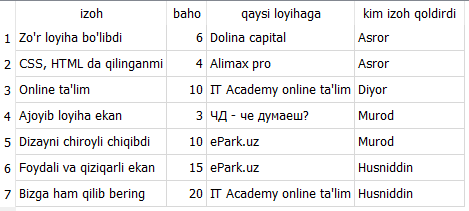

# Mavzu 3: QuerySet. Filtr va shartlar bilan ishlash

## Reja:

1. [Bilim](#1-bilim)
   - [1.1 Terminlar](#11-terminlar)
   - [1.2 O'qish uchun materiallar](#12-oqish-uchun-materiallar)
2. [Amaliyot. O'qituvchi](#2-amaliyot-oqituvchi)
3. [Amaliyot. O'quvchi](#3-amaliyot-oquvchi)

## 1. Bilim

### 1.1 Terminlar

```
tuple - o'zgarmas ro'yxat. s'ni boshida bir marta qiymat beriladi, keyin o'zgartirib bo'lmaydi
element - ro'yxat tarkibidagi har bir qiymat
indeks - elementlarning ro'yxatdagi pozitsiyasi
```

### 1.2 O'qish uchun materiallar

- [w3schools - py tuples](https://www.w3schools.com/python/python_tuples.asp)
- [sariq dev - Ro'yxat bilan ishlash](https://python.sariq.dev/ozgaruvchilar-va-malumot-turlari/08-list-tuple)

## 2. Amaliyot. O'qituvchi

**Reja:**

- [2.1 INSERT - kiritish]
- [2.2 SELECT - olish]
  - [2.2.1 all]
  - [2.2.2 get]
  - [2.2.3 filter]
  - 2.2.4 exclude
- 2.3 Shartlar
  - [2.3.1 exact]
  - [2.3.2 iexact]
  - [2.3.3 contains]
  - [2.3.4 icontains]
  - [2.3.5 in]
  - [2.3.6 gt]
  - [2.3.7 gte]
  - [2.3.8 lt]
  - [2.3.9 lte]
  - [2.3.10 startswith]
  - [2.3.11 istartswith]
  - [2.3.12 endswith]
  - [2.3.13 iendswith]
  - [2.3.14 range]
  - [2.3.15 date]
  - [2.3.16 year]
  - [2.3.17 iso_year]
  - [2.3.18 month]
  - [2.3.19 day]
  - [2.3.20 week]
  - [2.3.21 week_day]
  - [2.3.22 iso_week_day]
  - [2.3.23 quarter]
  - [2.3.24 time]
  - [2.3.25 hour]
  - [2.3.26 second]
  - [2.3.27 isnull]
  - [2.3.27 regex]
  - [2.3.28 iregex]
- [2.4 UPDATE - o'zgartirish]
- [2.5 DELETE - o'chirish]

#### **str**

##### Profile

```text
class Profile(models.Model):
    ...
    def __str__(self):
      return f"{self.user.last_name} {self.user.first_name}"
```

##### Project

```text
class Project(models.Model):
    ...
    def __str__(self):
        return f"{self.title}"
```

##### Message

```text
class Message(models.Model):
    def __str__(self):
        return f"{self.subject}"
```

##### Skill

```text
class Skill(models.Model):
    ...
    def __str__(self):
        return f"{self.name}"

```

##### Review

```text
class Review(models.Model):
    ...
    def __str__(self):
        return f"{self.body}"
```

##### Tag

```text
class Tag(models.Model):
    ...
    def __str__(self):
        return f"{self.name}"

```

#### 2.1.1 INSERT - kiritish

Ma'lumot kiritishning bir necha usulini ko'ramiz:

- Admin panel yordamida
- DB Browser yordamida
- Django konsolda yoki Django loyihasida

Admin paneldan va DB browserda qanday qilib ma'lumot kiritish bo'yicha vazifalarni bajarasiz
<br>
So'ng python (Django konsolda yoki Django loyihasida) orqali qaday amalga oshirilishini ko'ramiz
<br>

**Vazifa**

1. Admin panel yordamida profile jadvalidagi tegga python va javascript teglarini qo'shing.
2. Admin panel yordamida profile jadvalidagi teglarni, ya'ni pyton va javascripti Django va React ga o'zgartiring
3. Admin panel yordamida Django va React teglarini o'chiring
4. DB Browserdan siz qo'shgan yozuvni ochib ko'rsating
5. Yuqoridagi ishlarni DB Browser Sqlite yordamida bajaring (Uyga)

Avval Django admin paneldan ma'lumotlar tushunarli holda ko'rishi uchun **str** metodlarni yozib chiqamiz

##### User

Avval Django konsolini ochib olamiz:

```commandline
python manage.py shell
```

1. User modeliga ma'lumot qo'shamiz

```text
>>> from django.contrib.auth.models import User
>>> asror = User.objects.create(username="Asror", first_name="Asror", last_name="Abduvosiqov",password="12!@qwQW")
>>> murod = User.objects.create(username="Murod", first_name="Murod", last_name="Kusherbayev",password="12!@qwQW")
>>> husniddin = User.objects.create(username="Husniddin", first_name="Husniddin", last_name="Muminov",password="12!@qwQW")
>>> User.objects.create(username="Diyor", first_name="Diyor", last_name="Malikov",password="12!@qwQW")
<User: Diyor>
>>> User.objects.create(username="Jasur", first_name="Jasur",password="12!@qwQW")
<User: Jasur>
>>> User.objects.create(first_name="Otabek")
>>> User.objects.create(first_name="Otabek")
django.db.utils.IntegrityError: UNIQUE constraint failed: auth_user.username
```

Ohirgi holatda xatolik beradi, chunki username ikkita foydaluvchida bir hil bo'lib qoladi, username UNIQUE (qaytarilmas) bo'lishi kerak

##### Profile

2. Profile modeliga ma'lumot kiritamiz

```text
>>> from users.models import Profile
>>> asror_profile = Profile.objects.create(user=asror, bio="lorem ipsum", location="Toshkent sh. Yunusobod t.", profile_image="portfolio/Asror.png", social_github="https://github.com/", social_website="https://www.gazeta.uz/uz/")
>>> murod_profile = Profile.objects.create(user=murod, bio="lorem ipsum", location="Toshkent sh. Sergeli t.", profile_image="portfolio/Murod.png")
>>> diyor = User.objects.get(username='Diyor')
>>> Profile.objects.create(user=diyor, bio="lorem ipsum", location="Toshkent sh. Mirzo Ulu'bek", profile_image="portfolio/Diyor.png")
>>> husniddin = User.objects.get(username='Husniddin')
>>> husniddin = User.objects.get(username='Husniddin')
django.db.utils.IntegrityError: UNIQUE constraint failed: users_profile.user_id
>>> Profile.objects.create(user=husniddin, bio="lorem ipsum", location="Toshkent v. Zagiota tumani", profile_image="portfolio/default_profile.webp", social_github="https://17husniddin.github.io/Potfolio/index.html", social_instagram="https://www.instagram.com/husnidd1n_17/")
>>> Profile.objects.create(bio="lorem ipsum", location="Toshkent v. Zagiota tumani")
AttributeError: 'NoneType' object has no attribute 'last_name'
```

Ohirgi holatda xatolik beradi, sababi **str** metodida user.last_name ko'rsatilgan , bu holatda esa user=None, shuning uchun userni ko'rsatish kerak

**Vazifa**<br>
Quyidagi Akbar, Sherzod, Bekzod, Eshmat, Toshmat, Jasur nomli foydalnuvchilar kiriting. Avval user ga so'ng, profile ga. Userga faqat username ni yozamiz. Profilega esa user va bioni yozamiz. Rasm o'rnida default qiymatni olsin
<br>

Mijozlar:

- Akbar
- Eshmat
- Toshmat
- Jasur
- Bekzod
- Sherzod

Bitiruvchi o'quvchilar:

- Asror
- Murod
- Husniddin
- Diyor

##### Message

Endi mijozlar o'quvchilarga habar qoldirishini ko'ramiz:

```text
>>> jasur_f = Profile.objects.get(user__username='Jasur')
>>> bekzod_f = Profile.objects.get(user__username='Bekzod')
>>> sherzod_f = Profile.objects.get(user__username='Sherzod')
>>> eshmat_f = Profile.objects.get(user__username='Eshmat')
>>> toshmat_f = Profile.objects.get(user__username='Toshmat')
>>> akbar_f = Profile.objects.get(user__username='Akbar')
>>> Message.objects.create(subject='Ish masalasida', body="Siz bilan gaplashsak bo'ladimi? Ishga taklif qilmoqchi edim", sender=akbar_f, receiver=asror_f)
>>> Message.objects.create(subject='Ish masalasida', body="Siz bilan qanday bog'lansak bo'ladi", sender=eshmat_f, receiver=diyor_f)
>>> Message.objects.create(subject='Ish masalasida', body="Yangi ish qidiryapsizmi", sender=jasur_f, receiver=diyor_f)
>>> Message.objects.create(subject='Ish masalasida', body="Ingliz tili darajangiz qanday?", sender=bekzod, receiver=husniddin_f)
>>> Message.objects.create(subject='Ish masalasida', body="Ingliz tili darajangiz qanday?", sender=bekzod, receiver=murod_f)
```

**Vazifa**
<br>
Akbar, Asror va Husniddin habar yuboruvchi bo'lsin, Toshmat, Diyor va Murod qabul qiluvchi bo'lsin, shunda message ga 3 ta qator yozuv yoziladi

##### Skill

**Vazifa**

Bitiruvchilarga quyidagi malakalarni kiriting.

- Asror - 1. Python, 2. Django 3. Django Rest framework
- Murod - 1. Javascript 2. React
- Husniddin - 1. CSS,HTML 2. Python. 3. Django
- Diyor - 1. Javascript 2. React 3. NextJs

##### Project

**Vazifa**
 loyihaga media/projects katalogiga ko'chiring.
<br>
So'ng bitiruvchilarga quyidagi loyihalarni va loyiha rasmi yo'li bilan nomini kiriting.

- Asror
  - title="IT Academy online ta'lim"
  - image="projects/project-1.png"
  - vote_count=100
  - vote_ratio=60
  - description="lorem ipsum"
- Murod

  - title="Kannas-textile"
  - image="projects/project-5.png"
  - vote_count=50
  - vote_ratio=90
  - description="lorem ipsum"

- Husniddin

  - title="Alimax pro"
  - image="projects/project-6.png"
  - vote_count=300
  - vote_ratio=90
  - description="lorem ipsum"

- Diyor

  - title="ePark.uz"
  - image="projects/project-2.png"
  - vote_count=150
  - vote_ratio=20
  - description="lorem ipsum"

  - title="ЧД - че думаеш?"
  - image="projects/project-3.png"
  - vote_count=200
  - vote_ratio=10
  - description="lorem ipsum"

  - title="Dolina capital"
  - image="projects/project-4.png"
  - vote_count=30
  - vote_ratio=70
  - description="lorem ipsum"

##### Review

**Vazifa**
Quyidagi ma'lumotlarni Review jadvaliga kiriting:


##### Tag

Endi ko'pga ko'p bog'lanishda ma'lumot kiritishni ko'rib o'tamiz
Avval taglarni kiritib olamiz

```text
>>> from projects.models import Tag
>>> py=Tag.objects.create(name='Python')
>>> re=Tag.objects.create(name='React')
>>> dj=Tag.objects.create(name='Django')
>>> drf=Tag.objects.create(name='Django Rest Framework')
>>> js=Tag.objects.create(name='Javascript')
>>> css=Tag.objects.create(name='CSS,HTML')
```

Endi esa teglarni loyiha obyektining tag hususiyatiga qo'shamiz. Avval loyihani id orqali qo'lga kiritamiz

```text
>>> from projects.models import Project
>>> for p in Project.objects.all():
...    print(f"{p.id} {p.title} {p.user}")
...
1 IT Academy online ta'lim Asror
2 ePark.uz Diyor
3 ЧД - че думаеш? Diyor
4 Dolina capital Diyor
5 Kannas-textile Murod
6 Alimax pro Husniddin
```

Deylik "IT Academy online ta'lim" dasturi teglariga "Python" va "Django Rest Framework" ni yozmoqchimiz. Unda avval id=1 bo'lgan loyihani get() metodi bilan olishimiz kerak. Keyin teglarni add() metodi bilan qo'shamiz

```text
>>> pr1 = Project.objects.get(id=1)
>>> pr1.tag.add(py, drf)
```

id=1 loyiha qaysi teglarini ko'rmoqchi bo'lsak

```text
>>> pr1.tag.all()
<QuerySet [<Tag: Python>, <Tag: Django Rest Framework>]>
```

**Vazifa**
Huddi shunday qolgan loyihalarga quyidagi teglarni kiritib, so'ng tekshiring

- 2 ePark.uz: React, Javascript
- 3 ЧД - че думаеш?: Python, Django, React, Javascript
- 4 Dolina capital: Javascript, "CSS,HTML"
- 5 Kannas-textile: React, Javascript, "CSS,HTML"
- 6 Alimax pro: Javascript, "CSS,HTML"

Endi bu bazani DB Browser dan ochib tahlil qiling. Tushunishga harakat qiling

#### 2.1.2 SELECT - olish

##### 2.1 all

all() metodi hamma obyektni olish uchun ishlatiladi.
<br>
Masalan hamma teglarni ekranga chiqarish uchun all() metodidan foydalanamiz

```text
from projects.models import Tag
for tag in Tag.objects.all():
  print(f"{tag.id} {tag.name}")

5 Python
6 React
7 Django
8 Django Rest Framework
9 Javascript
10 CSS,HTML
```

**Vazifa**
Hamma loyiha, profil, malaka, izoh, habarlarni ekranga chiqaring

##### 2.2 get

Bitta obyektni qo'lga kiritish uchun get() metodi ishlatiladi. Parametrga shartini yozamiz. Shartlar murakkab bo'lishi mumkin, hozircha soddasini ko'rib turamiz

id=1 bo'lgan loyihani chiqarish

```text
>>> from projects.models import Project
>>> Project.objects.get(id=1)
<Project: IT Academy online ta'lim>
```

id=1 bo'lgan loyiha nechta ovoz to'plagan

```text
>>> from projects.models import Project
>>> pr=Project.objects.get(id=1)
>>> pr.vote_count
100
```

Demak id=1 bo'lgan loyiha 100 ovoz to'plagan ekan

Nomi 'ePark.uz' bo'lgan loyiha qaysi dasturlash tillarida va freymworklarda ishlatilgan?

```text
>>> from projects.models import Project
>>> pr=Project.objects.get(title='ePark.uz')
>>> pr.tag.all()
<QuerySet [<Tag: React>, <Tag: Javascript>]>
```

**Vazifa**

1. Nomi 'ePark.uz' bo'lgan loyihani qaysi dasturchi qilgan
2. id=2 bo'lgan loyiha qancha ovoz to'plagan
3. 'Alimax pro' nomli loyiha demo linkini chiqaring

##### 2.3 filter

Agar natija bir nechta bo'lsa, unda filter metodini qo'llaymiz.

100 ta ovoz olgan loyihalar ro'yxatini chiqaring

```text
>>> for pr in Project.objects.filter(vote_count=100):
...    print(pr.title)
...
IT Academy online ta'lim
```

###### 2.3.1 exact

exact sharti aynan berilgan qiymatga tengligini tekshiradi
<br>
Aynan Asrorni malakalarini chiqaring

```text
>>> Skill.objects.filter(user__exact=asror)
<QuerySet [<Skill: Python>, <Skill: Django>, <Skill: Django Rest Framework>]>
```

Web sahifasi bo'lmagan dasturchilar ro'yxatini chiqaring:

```text
>>> [pr.user.username for pr in Profile.objects.filter(social_website__exact=None)]
['Murod', 'Husniddin', 'Diyor', 'Akbar', 'Bekzod', 'Sherzod', 'Eshmat', 'Toshmat', 'Jasur']
```

**Vazifa**

1. Video yuklamagan foydalanuvchilar ro'yxati
2. Profil id=15 bo'lgan foydalanuvcilar ro'yxati

###### 2.3.2 iexact

Qiymatni solishtirganda harflar kichik yoki kattaligiga ahamiyat bermaydi
<br>
Nomi 'asror' bo'lgan foydalanuvchini chiqarish kerak

```text
>>> [pr.username for pr in User.objects.filter(first_name='asror')]
[]
>>> [pr.username for pr in User.objects.filter(first_name__exact='asror')]
[]
>>> [pr.username for pr in User.objects.filter(first_name__iexact='asror')]
['Asror']
```

**Vazifa**

1. Nomi 'alimax pro' bo'lgan loyihani get() metodi bilan chiqaring

###### 2.3.3 contains

contains tarkibida bor yo'qligini tekshiradi
<br>
Ismida z harfi bor bo'lgan dasturchilar ro'yxatini chiqaring
Avval hammasini ko'rib olamiz:

```text
>>> [user.username for user in User.objects.all()]
['admin', 'Asror', 'Murod', 'Husniddin', 'Diyor', 'Jasur', '', 'Akbar', 'Bekzod', 'Sherzod', 'Eshmat', 'Toshmat']
```

Endi shart bilan chiqaramiz

```text
>>> [user.username for user in User.objects.filter(username__contains='z')]
['Bekzod', 'Sherzod']
```

**Vazifa**

1. Nomida '.' belgisi bor loyihalar ro'yxatini chiqaring
2. Nomida 'IT' yozuvi bor loyihalar ro'yxatini chiqaring

###### 2.3.4 icontains

icontains tarkibida bor yo'qligini tekshiradi, contain() metodidan farqi harf katta yoki kichikligini ahamiyati yo'q
SQLite da contains va icontains bir hil ishlaydi

###### 2.3.5 in

in sharti berilgan ro'yxatdan kamida bittasi mavjud ekanligini tekshiradi
<br>Python yoki Go ishlatilgan loyihalar ro'yxatini chiqaring

```text
>>> print("\n".join([pr.title for pr in Project.objects.filter(tag__name__in=['Python', 'Go'])]))
IT Academy online ta'lim
ЧД - че думаеш?
```

Asror bilan Husniddin qilgan loyihalarni chiqaring

```text
>>> print("\n".join([pr.title for pr in Project.objects.filter(user__in=[asror, husniddin])]))
IT Academy online ta'lim
Alimax pro
```

**Vazifa**

1. Ovozlar soni 100 yoki 200 yokii 300 ga teng bo'lgan loyiha nomlarini chiqaring
2. Asror yoki Husniddin loyihalarga bergan fikrlarini, qaysi loyihaga fikr berganlari ro'yxatini chiqaring

###### 2.3.6 gt

###### 2.3.6 gte

###### 2.3.6 lt

###### 2.3.6 lte

gt,gte,lt,lte solishtirish uchun ishlatiladi. Ma'nolari:

- gt - katta
- gte - katta yoki teng
- lt - kichik
- lte - kichik yoki teng

Ovozlar soni 100 dan katta bo'lgan loyihalarni, uni qilgan dasturchini chiqaring

```text
>>> [(pr.id, pr.user, pr.title) for pr in Project.objects.filter(vote_count__gt=100)]
[(2, <Profile: Diyor>, 'ePark.uz'), (3, <Profile: Diyor>, 'ЧД - че думаеш?'), (6, <Profile: Husniddin>, 'Alimax pro')]
```

Tizimga 06.07.2022 sanada kirgan yoki undan avval qo'shilgan dasturchilarni chiqaring

```text
[(pr.created, pr.user) for pr in Profile.objects.filter(created__lte=date(day=6,month=7,year=2022))]
[(datetime.date(2022, 7, 6), <User: Asror>), (datetime.date(2022, 7, 6), <User: Murod>)]
```

**Vazifa**

1. Ovozlar nisbati 50 dan katta bo'lgan loyihalarni nomini va uni qilgan dasturchi ismini chiqaring
2. 01.01.2022 dan 08.08.202 oraliqda ro'yxatdan o'tgan dasturchilarni chiqaring
   <br>Yoram uchun [quyidagi](https://docs.djangoproject.com/en/4.0/ref/models/querysets/#operators-that-return-new-querysets) linkka kiring

###### 2.3.10 startswith

###### 2.3.11 istartswith

###### 2.3.12 endswith

###### 2.3.13 iendswith

- endswith - berilgan qiymat bilan tugashini tekshiradi
- iendswith - endswith bilan o'xashash, faqat harf katta kichikligini ahamiyati bo'lmaydi
- startswith - berilgan qiymat bilan boshlanishini tekshiradi
- istartswith - berilgan startswith bilan o'xashash, faqat harf katta kichikligini ahamiyati bo'lmaydi

Ismi zod bilan tugaydigan foydalanuvchilarni chiqaring

```text
>>> User.objects.filter(username__endswith='zod')
<QuerySet [<User: Bekzod>, <User: Sherzod>]>
```

Ismi a dan boshlanadigan foydalanuvchilarni chiqaring

```text
>>> User.objects.filter(username__startswith='a')
<QuerySet [<User: admin>, <User: Asror>, <User: Akbar>]>
```

SQLite da startwith bilan istartswith bir hil ishlaydi

**Vazifa**

1. Nomi ka bilan boshlanadigan loyihalarni chiqaring
2. Nomi .uz bilan tugaydigan loyihalarni chiqaring
3. Rasmi .png bilan tugaydigan foydalanuvchilarni chiqaring

###### 2.3.14 range

range ikki qiymat orasida yotishini tekshiradi

01.01.2022 dan 08.08.202 oraliqda ro'yxatdan o'tgan dasturchilarni chiqaring

```text
>>> [(pr.created, pr.user) for pr in Profile.objects.filter(created__range=(date(day=6,month=7,year=2022),date(day=6,mon
th=7,year=2022)))]
[(datetime.date(2022, 7, 6), <User: Asror>), (datetime.date(2022, 7, 6), <User: Murod>)]
```

**Vazifa**

1. Ovozlar soni 100 bilan 500 oraliqda bo'lgan loyihalarni chiqaring

###### 2.3.15 date

###### 2.3.16 year

###### 2.3.17 iso_year

###### 2.3.18 month

###### 2.3.19 day

###### 2.3.20 week

###### 2.3.21 week_day

###### 2.3.22 iso_week_day

###### 2.3.23 quarter

Yuqoridagi shartlar sana bilan ishlaydi:

- date solishtirish uchun sanani olib beradi
- year solishtirish uchun yilni olib beradi
- month solishtirish uchun oyni olib beradi
- day solishtirish uchun kunni olib beradi
- week solishtirish uchun yildagi hafta tartibini (1-52/53) olib beradi
- week_day solishtirish uchun hafta kunini (1-yakshanba, 7-dushanba) olib beradi
- iso_week_day solishtirish uchun hafta kunini (1-dushanba,7-yakshanba) olib beradi
- quarter solishtirish uchun fasl tartibini olib beradi (1-4)

**Vazifa**

1. 2022 yilda ro'yxatdan o'tgan foydalanuvchilarni chiqaring
2. aprel oyida ro'yxatdan o'tgan foydalanuvchilarni chiqaring
3. 10 sanada ro'yxatdan o'tgan foydalanuvchilarni chiqaring
4. sanasi 10gacha ro'yxatdan o'tgan foydalanuvchilarni chiqaring

###### 2.3.24 time

###### 2.3.25 hour

###### 2.3.26 second

Yuqoridagi shartlar vaqt bilan ishlaydi.

- time solishtirish uchun vaqtni olib beradi
- hour solishtirish uchun soatni olib beradi
- minute solishtirish uchun daqiqani olib beradi
- second solishtirish uchun soniyani olib beradi

**Vazifa**

1. Bugun yuborilgan habarlarni chiqaring
2. Soat 14 da yuborilgan habarlanri chiqaring
3. Soat 9-12 oraliqda yuborilgan habarlarni chiqaring
4. 12.7.2022 sanada 9-12 oraliqda yuborilgan habarlarni chiqaring
