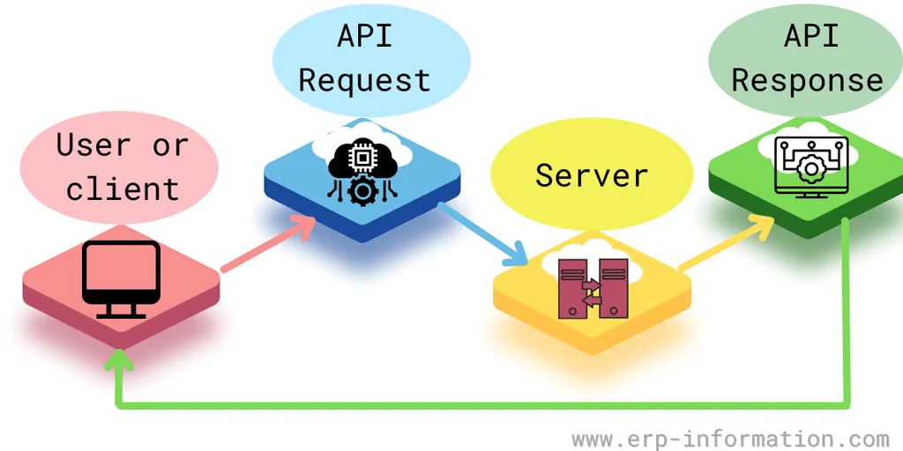
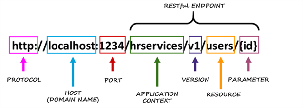
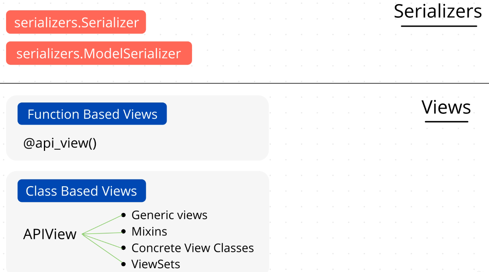

# Mavzu 1: API va REST API

## Reja:

- [1 Terminlar](#1-terminlar)
- [2 Nazariya](#2-nazariya)

## 1 Terminlar

```
API - application programming interface. API - bu ikki kompyuterni yoki ikki ilovani bog'lab turuvchi dasturdir. API boshqa ilovalarga hizmat ko'rsatuvchi dastur interfeysidir. Oddiy qilib aytganda u **habar yetkazuvchidir**
REST - Agar API REST arxitekurasi (qoidasi) bo'yicha tuzilgan bo'lsa, u holda u REST API deyiladi.
status code - serverdan qaytgan Response holatini bildiruvchi kodlar
CRUD - Creat (yangi tuzish) Read (o'qish) Update (o'zgartirish) Delete (o'chirish). http method turlariga qo'llaniladi
JSON - JavaScript Object Notation. REST API shu formatda ishlatiladi.
Host name - URLda o'zgarmaydigan qismi
Endpoint - URLdagi o'zgaradigan qismi
```

## 2 Nazariya

**Reja**

- [2.1 API](#21-api)
  - [2.1.1 API nima?](#211-api-nima)
  - [2.1.2 API foydalari](#212-api-foydalari)
  - [2.1.3 API turlari](#213-api-turlari)
  - [2.1.4 API protokollari](#214-api-protokollari)
  - [2.1.5 API hujjati](#215-api-hujjati)
- [2.2 REST API](#22-rest-api)
  - [2.2.1 Terminlar](#221-terminlar)
  - [2.2.2 Misollar](#222-misollar)

### 2.1 API

#### 2.1.1 API nima?

[Manba](https://dev.to/ayushi7rawat/what-is-an-api-api-for-beginners-4mfh)

<p>API - bu ikki kompyuterni yoki ikki ilovani bog'lab turuvchi dasturdir. API boshqa ilovalarga hizmat ko'rsatuvchi dastur interfeysidir. Oddiy qilib aytganda u **habar yetkazuvchidir**
</p><p>
Keling tushunib olish oson bo'lishi uchun bitta real bo'lmagan misol ko'ramiz
</p><p>
Aytaylik, siz restoranga tashrif buyurdingiz, xizmatkor sizga menyuni taqdim etdi. Nima yeyishni o'zingiz hal bilasiz. Bu pitsa, makaron yoki kartoshka bo'lishi mumkin. Xizmatkor buyurtmangizni oshpazga olib boradi. Ovqatingiz tayyor bo'lgach, u yana sizga yetkazib beradi.
</p>


<p>
Bu juda oddiy jarayon. Ovqat qanday tayyorlanishi yoki oshxona ichida sodir bo'ladigan boshqa narsalar haqida tashvishlanishingiz shart emas. Bu yerda xizmatkor API vazifasini bajaradi. U siz va oshxona o'rtasidagi aloqani o'rnatadigan vositadir.
</p><p>
API nimaligini haqida tasavvurga ega bo'ldik deb umid qilaman. Endi esa real misolni ko'ramiz
</p><p>
Deylik birorta ilovada ro'yxatdan o'tishingiz kerak, odatda ko'p ilovalarda Facebook yoki Google orqali ro'yxatdan o'tish imkoniyati bo'ladi. 
</p><p>
Bu qanday ishlashini hech o'ylab ko'rganmisiz?
</p>


<p>
Facebook va Google allaqachon sizning ma'lumotlaringizga ega, shuning uchun har bir foydalanuvchining ma'lumotlarini qaytadan yozish kabi zerikarli vazifani bajarish o'rniga, ilova API orqali ularning ma'lumotlar bazasiga kirib, kerakli ma'lumotlarni olib, ro'yxatdan o'tkazib qo'yadi.
</p>


<p>
Yana bir mashhur misol - ob-havo ilovasi. Agar siz uni dasturini yozmoqchi bo'lsangiz, siz jismonan borib, butun dunyo bo'ylab ma'lumotlarni yozib ololmaysiz. Buning o'rniga ob-havo ma'lumotlarini olish uchun tegishli API-dan foydalanishingiz mumkin.
</p>


<p>
Xo'sh, bu o'g'irlik uchun eshiklarni ochadi. Shuning uchun API kalitlaridan foydalanadi. API kaliti identifikatsiya va avtorizatsiya uchun ishlatiladi, bu foydalanuvchilarni kuzatib borish uchun ishlatiladigan xavfsizlik kodidan boshqa narsa emas. Aytish joizki, har bir APIda ham kalit mavjud emas.
</p>


<p>
Bundan tashqari, kompaniyalar odatda tashqi ilovalardan o'z xizmatlari va mahsulotlariga kirishni ta'minlash uchun ulardan foydalanadilar.
</p><p>
Ular ko'pincha mobil ilovalarni ishlab chiqishda ishlatiladi, lekin ular ikki xil veb-saytlarni ulash yoki uchinchi tomon dasturlari bilan integratsiya qilish uchun ham ishlatilishi mumkin.
</p>



#### 2.1.2 API foydalari

- Ko'rinish va tirbandlikni oshirish
- Uzluksiz integratsiya
- Samaradorlikni oshirish
- Osonroq texnik xizmat ko'rsatish
- Kamaytirilgan xarajatlar
- Murakkablikni yashiradi


- Request - so'rov bo'lib, mijozdan serverga yuboriladi. (Masalan "mahsulotlar ro'yxati" ni ko'rish uchun so'rov)
- Response - javob bo'lib, serverdan mijozga so'rovga javob sifatida yuboriladi. (Masalan "mahsulotlar ro'yxati" so'roviga tegishli ma'lumotlarni qaytarish)
  <br>
  API qaysi qurilmalar tomonidan ishlatiladi?

- Android
- iOS
- Browser
- Desktop

#### 2.1.3 API turlari

[Manba](https://www.erp-information.com/application-programming-interface.html)
<br><br>
**Maqsadiga ko'ra turlari:**

- **Ma'lumot API**. Bunday APIlar ma'lumotlar bazalari yoki veb-xizmatlar kabi turli manbalardan ma'lumotlarga kirish imkonini beradi. Ular ko'pincha ma'lumot olish yoki hisob-kitoblarni amalga oshirish uchun ishlatiladi.
- **Funksional API**. Masalan, ular yordamida hisobingizni boshqarishingiz yoki onlayn mahsulotlarni xarid qilishingiz mumkin.
- **Qayta ishlovchi API**. Masalan, faylni bir formatdan boshqasiga o'zgartirish yoki ziplab saqlash uchun siqib qo'yishlar misol bo'ladi.

<br>

**Ishlatilishiga ko'ra turlari:**

- **Ochiq**. Ular minimal cheklovlar bilan foydalanuvchilar uchun mavjud. Foydalanuvchilar HTTP protokoli orqali ularga kirishlari mumkin.
- **Hamkorlik**. Ular texnik jihatdan ochiq API bilan bir xil, lekin cheklangan kirishga ega
- **Yopiq**. Ular tashqi foydalanuvchilardan yashiringan. Ulardan kompaniya ichida foydalanish mumkin.

#### 2.1.4 API protokollari

- **HTML**. HTML veb-sahifaga asoslangan. Foydalanish oson, lekin imkoniyati cheklangan
- **XML**. HTMLga qaraganda imoniyati ko'p, ammo undan foydalanish murakkabroq bo'lishi mumkin.
- **JSON**. XML-ga nisbatan yengil bo'lib, uni o'qish va yozish oson. U RESTful API-larda mashhur, chunki u tez va samarali.

#### 2.1.5 API hujjati

API hujjati bu APIdan qanday foydalanish haqidagi ma'lumotdir.
<br>
<br>
Hujjatdan quyidagi savollarga javob berish mumkin:

- qanday API lar mavjud?
- qanday metod ishlatiladi (get,post,put,...)
- qanday ma'lumotlar mijoz tarafidan yuborish kerak
- qanday ma'lumotlar serverdan qaytib keladi
- nechta ma'lumot keladi
- ma'lumotlar qanday nom bilan keladi


### 2.2 REST API

#### 2.2.1 Terminlar

REST - Representational state transfer.
<br>
Agar API REST arxitekurasi (qoidasi) bo'yicha tuzilgan bo'lsa, u holda u REST API deyiladi.

<br>
Terminlar bilan tanishamiz:

- endpoint
- method (CRUD)
- Headers (status code)
- ma'lumot (JSON)

##### Endpoint va host name



<br>Host name - URLda o'zgarmaydigan qismi
<br>Endpoint - URLdagi o'zgaradigan qismi
<br>


1-URL hamma ma'lumotlar uchun:

- method GET bo'lsa, hamma kinolarni qaytaradi
- method POST bo'lsa, yangi kino kiritadi
  <br>

2-URL individual ma'lumot uchun:

- method GET bo'lsa, id=127 bo'lgan kino haqida to'liq ma'lumotni qaytaradi
- method PUT bo'lsa, id=127 bo'lgan kinoga tegishli ko'rsatilgan ma'lumotini o'zgartiradi
- method DELETE bo'lsa, id=127 bo'lgan kinoni o'chiradi

##### [Serializer](https://www.django-rest-framework.org/tutorial/1-serialization/):


Serialize - Murakkab obyektni JSON formatiga mos bo'lgan dict toifasiga o'girib berish
<br>


Turlari:

- Serialize - Python dagi obyektni json formatiga moslab beradi. Bu jarayon so'rov jo'natganda (Request) ishlatiladi <br>
- Deserialize - Json formatni Python obyektiga o'girish. Bu jarayon so'rovga javob kelgan (Response) ishlatiladi
  <br>


<br>
Serializer turlari:

- serializers.Serializer
- serializers.ModelSerializer

##### [View](https://www.django-rest-framework.org/api-guide/views/)

Turlari:

- Class based
- Function based

API bilan ishlavchi dasturlar

- DRF Browser API
- Postman
- HTTPie

##### Method (CRUD)


<p>
CRUD termini ko'p ishlatiladi. CRUD shunchaki boshqacha nomlanishi. Creat (yangi tuzish) Read (o'qish) Update (o'zgartirish) Delete (o'chirish) so'zlarining qisqartmasidir.
</p>


##### Headers (Status code)

Umumiylashtirilgan ko'rinishi:
<br>


<br>
To'liqroq:


##### Ma'lumot (JSON)


#### 2.2.2 Misollar

Mahsulotlar ro'yxati uchun:

- https://www.api.movielist.com/movies/
- https://www.api.movielist.com/movies/list/

Individual mahsulot uchun

- https://www.api.movielist.com/movies/102/
- https://www.api.movielist.com/movies/102/reviews/
- https://www.api.movielist.com/movies/102/reviews/?limit=20

Kirish va ro'yxatdan o'tish uchun

- https://www.api.movielist.com/movies/account/login/
- https://www.api.movielist.com/movies/account/register/
