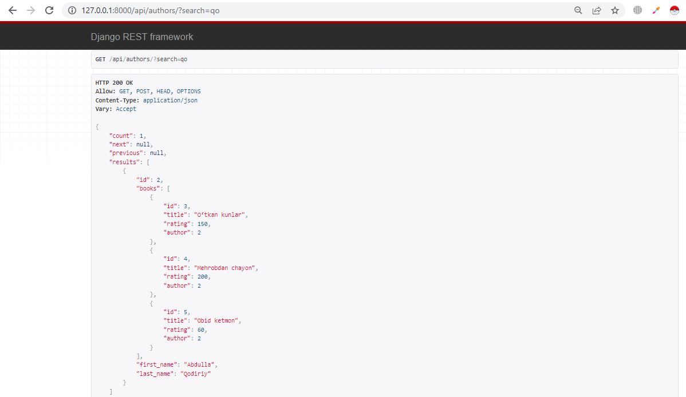
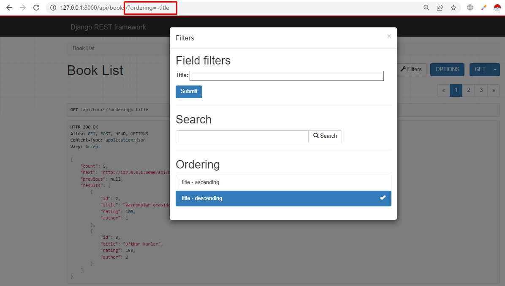
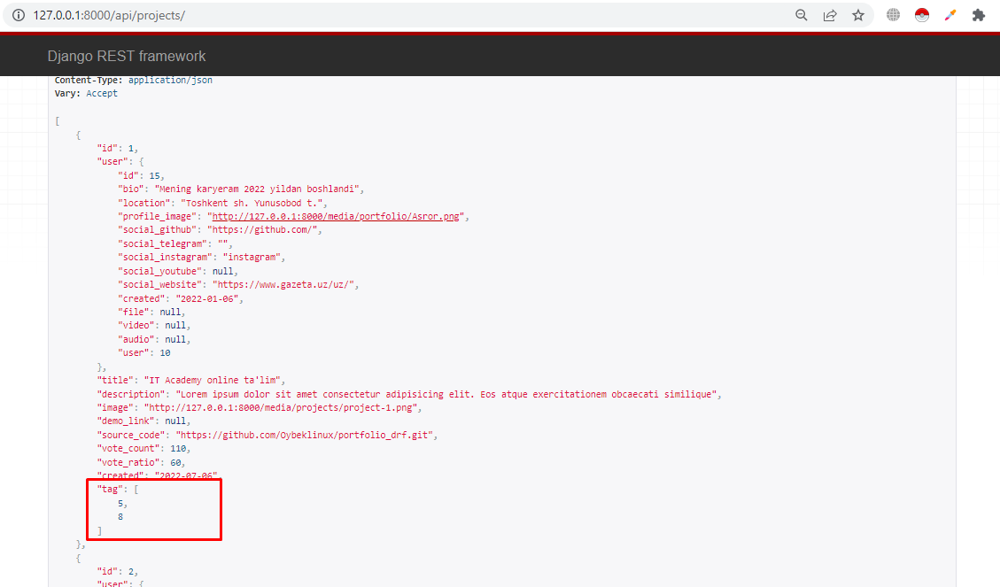
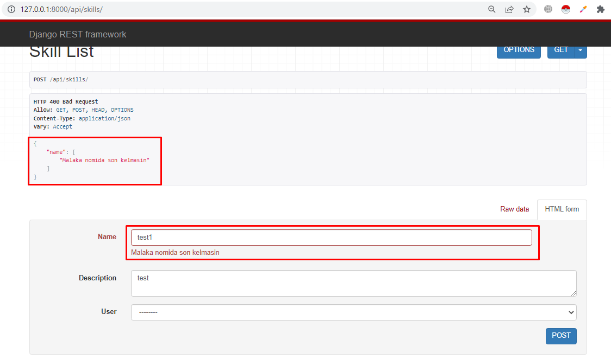

# Mavzu 7: API va REST API

## Reja:

1. [Bilim](#1-bilim)
   - [1.1 Terminlar](#11-terminlar)
   - [1.2 O'qish uchun materiallar](#12-oqish-uchun-materiallar)
2. [Amaliyot. O'qituvchi](#2-amaliyot-oqituvchi)
3. [Amaliyot. O'quvchi](#3-amaliyot-oquvchi)

## 1. Bilim

### 1.1 Terminlar

```

```

## 2. Amaliyot. O'qituvchi

**Reja:**

- [2.1 Viewda modellarni qo'llash](#21-viewda-modellarni-qollash)
- [2.2 DRF. Serializer](#22-drf-serializer)
- [2.3 DRF. Function based view](#23-drf-function-based-view)
  - [2.3.1 GET - Read](#231-get---read)
  - [2.3.2 POST - Create](#232-post---create)
  - [2.3.3 PUT - Update](#233-put---update)
  - [2.3.4 DELETE - Delete](#234-delete---delete)
- [2.4 DRF. Postman bilan ishlash](#24-drf-postman-bilan-ishlash)
  - [2.4.1 GET - Read](#241-get---read)
  - [2.4.2 POST - Create](#242-post---create)
  - [2.4.3 PUT - Update](#243-put---update)
  - [2.4.4 DELETE - Delete](#244-delete---delete)
- [2.5 DRF. APIdan qaytadigan xatoliklar](#25-drf-apidan-qaytadigan-xatoliklar)
  - [2.5.1 GET - Read](#251-get---read)
  - [2.5.2 POST - Create](#252-post---create)
  - [2.5.3 PUT - Update](#253-put---update)
  - [2.5.4 DELETE - Delete](#254-delete---delete)

Ma'lumotlar bazasini yuklab oling

### 2.1 Viewda modellarni qo'llash

Mashqlarni bajarishdan avval quyidagi amallarni bajaramiz:

1. stduents_portfolio.urls
   Bu yerda quyidagi qatorni kiritamiz

```python
from django.contrib import admin
from django.urls import path, include
from django.conf.urls.static import static
from django.conf import settings


urlpatterns = [
    path('admin/', admin.site.urls),
    # quyidagi 1 qator kod qo'shiladi
    path('api/', include('projects.urls'))
]
```

2. projects katalogida yangi urls.py nomli fayl ochamiz, keyin quyidagi kodni yozamiz

```python
from django.contrib import admin
from django.urls import path
from .views import *

urlpatterns = [

]
```

Alohida urls.py ochib oldik, endi mashqlar orqali API yasashni o'rganamiz. Bu yerda hamma API json da qaytariladi

1. Hamma loyihalarni qaytaradigan API yasang
<p><b>views.py</b></p>

```python
from django.http import JsonResponse
from .models import *


def get_projects(requests):
    data = Project.objects.all().values()
    print(data[:2])
    print(type(data))
    print(list(data)[:2])
    response = {"projects": list(data)}
    return JsonResponse(response)
```

<p><b>urls.py</b></p>

```python
# bu yerda kodlar bo'ladi, faqat quyidagi o'zgartirishni qilasiz, uni o'zingiz bilib bilib o'zgartirish kiriting

urlpatterns = [
    path('projects/', get_projects)
]
```

Endi ishga tushirib browzerdan http://127.0.0.1:8000/api/projects/ urlni teramiz

```text
python manage.py runserver
```

<b>Natija</b>: Qora ekranda

```txt
<QuerySet [{'id': 1, 'title': "IT Academy online ta'lim", 'description': 'Lorem ipsum dolor sit amet consectetur adipi
sicing elit. Eos atque exercitationem obcaecati similique', 'image': 'projects/project-1.png', 'demo_link': None, 'sou
rce_code': 'https://github.com/Oybeklinux/portfolio_drf.git', 'vote_count': 110, 'vote_ratio': 60, 'created': datetime
.date(2022, 7, 6), 'user_id': 15}]>

=========

<class 'django.db.models.query.QuerySet'>

=========

[{'id': 1, 'title': "IT Academy online ta'lim", 'description': 'Lorem ipsum dolor sit amet consectetur adipisicing eli
t. Eos atque exercitationem obcaecati similique', 'image': 'projects/project-1.png', 'demo_link': None, 'source_code':
 'https://github.com/Oybeklinux/portfolio_drf.git', 'vote_count': 110, 'vote_ratio': 60, 'created': datetime.date(2022
, 7, 6), 'user_id': 15}]
```

<b>Natija</b>: Brovzerda


2. id orqali tegishli loyihani qaytaradigan API yasang

<p><b>views.py</b></p>

```python
from django.http import JsonResponse
from .models import *

# Bu yerda kodlar bor

def get_project(requests, id):
    data = Project.objects.get(id=id)
    print(data)
    print('=========')
    print(type(data))
    print('=========')
    data = data.__dict__
    print(data)
    data.pop('_state', 'not found')
    response = data
    return JsonResponse(response)
```

<p><b>urls.py</b></p>

```python
# bu yerda kodlar bo'ladi, faqat quyidagi o'zgartirishni qilasiz, uni o'zingiz bilib bilib o'zgartirish kiriting

urlpatterns = [
    #bu yerda kod bor
    path('projects/<int:id>', get_project),
]
```

Endi ishga tushirib browzerdan http://127.0.0.1:8000/api/projects/3/ urlni teramiz

```text
python manage.py runserver
```

<b>Natija</b>: Qora ekranda

```txt
ЧД - че думаеш?

=========

<class 'projects.models.Project'>

=========

{'_state': <django.db.models.base.ModelState object at 0x000002658947E680>, 'id': 3, 'title': 'ЧД - че думаеш?', 'desc
ription': 'Lorem ipsum dolor sit amet consectetur adipisicing elit. Eos atque exercitationem obcaecati similique', 'im
age': 'projects/project-3.png', 'demo_link': None, 'source_code': None, 'vote_count': 210, 'vote_ratio': 10, 'created'
: datetime.date(2022, 7, 6), 'user_id': 20}
```

<b>Natija</b>: Brovzerda



3. Bu mashqni bajarishdan avval Tag modeliga name hususiyatiga unique beramiz. Ya'ni qaytarilmas bo'lsin

<p><b>projects/models.py</b></p>

```python
class Tag(models.Model):
    name = models.CharField(max_length=100, unique=True)
    created = models.DateField(auto_now_add=True)

    def __str__(self):
        return f"{self.name}"

```

Endi quyidagi komandani teramiz

```text
>>> python manage.py makemigrations
>>> python manage.py migrate
```

Endi vazifaga kirishamiz: <br>

3. Tag kiritish uchun API yasang

<p><b>projects/views.py</b></p>

```python
from django.http import JsonResponse
from .models import *

# Bu yerda kodlar bor

def insert_tag(request, name):
    try:
        tag = Tag.objects.create(name=name)
    except Exception as error:
        data = { "ok": False, "error": str(error)}
    else:
        data = tag.__dict__
        data.pop('_state')
        data["ok"] = True
        data["error"] = ""

    return JsonResponse(data)
```

<p><b>projects/urls.py</b></p>

```python
# bu yerda kodlar bor

urlpatterns = [
    #bu yerda kodlar bor
    path('tags/<str:name>/', insert_tag),
]
```

Endi ishga tushirib browzerdan http://127.0.0.1:8000/api/tags/javascript/ urlni teramiz

```text
python manage.py runserver
```

<b>Natija</b>: Brovzerda


<br>

Brovzerni yangilaymiz, yan'ni yana bir marta ishga tushiramiz

<b>Natija</b>: Brovzerda


<br>
Ikkinchi marta javascript so'zini kiritib bo'lmaydi, chunki biz modelda unique=True qo'yganmiz, shuning uchun xatolik beradi

4. Postmanda 1-mashqdagi APIni bajaring
   Avval [Postman dasturini](https://www.postman.com/downloads/) o'rnatib, "student portfolio" nomli collection ochamiz.
   Keyin yangi request qo'shamiz:

- urlga: http://127.0.0.1:8000/api/projects/<br>
- method: GET

Send ni bosamiz. Natija quyidagicha bo'ladi



<br>
Bu yerda 1-mashqdagi APIni Postmanda ishlatib ko'ryapmiz.

5. Loyiha kiritadigan API yasang
   <br>

<p><b>projects/views.py</b></p>

```python

# bu yerda kodlar bor

def insert_project(request):

    title = request.headers['title']
    definition = request.headers['definition']
    user = request.headers['user']
    try:
        project = Project.objects.create(title=title,
                                         description=definition,
                                         user_id=user
                                         )
    except Exception as error:
        data = {
            "error": str(error)
        }
        return JsonResponse(data)

    data = project.__dict__
    data.pop('_state', '')
    data.pop('image', '') # rasmni jsonga o'girib bo'lmaydi
    return JsonResponse(data)

```

<p><b>projects/urls.py</b></p>

```python
# Bu yerd kodlar bor

urlpatterns = [
    # Bu yerd kodlar bor
    path('projects/insert/', insert_project),
]
```

Endi Postmanda sinash uchun 3-mashqda bajarilgan APIni copy qilib nomini o'zgartiramiz


<br>

<br>

Endi ishga tushirib browzerdan http://127.0.0.1:8000/api/projects/insert/ urlni teramiz

```text
python manage.py runserverm
```

<b>Natija</b>: Postmanda



<br>
Hozircha user_id ni DB Browser for SQLite dasturidan ko'rib olamiz. Ya'ni profile jadvalidagi id lar

6. Loyihani o'chiradigan API yasang

<p><b>projects/views.py</b></p>

```python
# Bu yerda kodlar bor

def delete_project(request, pk):
    project = Project.objects.get(id=pk)
    project.delete()
    return JsonResponse({"message": 'Project is deleted'})
```

<p><b>projects/urls.py</b></p>

```python
# Bu yerda kodlar bor

urlpatterns = [
   # Bu yerda kodlar bor
    path('projects/delete/<int:pk>/', delete_project),
]
```

Endi Postmandan ishga tushiramiz

<b>Natija</b>: Brovzerda


7. Loyihani o'zgartiradigan API yasang

<p><b>projects/views.py</b></p>

```python
# Bu yerda kodlar bor

def edit_project(request, pk):
    try:
        project = Project.objects.get(id=pk)
    except Exception as error:
        return JsonResponse({"error": str(error)})

    project.title = request.headers['title']
    project.description = request.headers['definition']
    project.save()
    data = project.__dict__
    data.pop('_state')
    data.pop('image')
    return JsonResponse(data)
```

<p><b>projects/urls.py</b></p>

```python
# Bu yerda kodlar bor

urlpatterns = [
   # Bu yerda kodlar bor
    path('projects/edit/<int:pk>/', edit_project),
]
```

Endi Postmandan ishga tushiramiz

<b>Natija</b>: Brovzerda


Yuqoridagilar hammasi mashq uchun edi. Aslida kiritish uchun POST, o'chirish uchun DELETE, o'zgartirish uchun PUT, PATCH, olish uchun GET metodi ishlatiladi. Bularni biz Django REST framework bilan birga ko'ramiz

### 2.2 DRF

Reja:

- DRFni o'rnatish
- Model (bu bajarilgan)
- Serializer
- View
- Urls
- Test

Avval DRF ni o'rnatib sozlab olamiz

O'rnatish

```txt
>>> pip install djangorestframework
```

Ro'yxatdan o'tkazish

<p><b>student_postfolio/settings.py</b> </p>

```python
INSTALLED_APPS = [
    ...
    'rest_framework',
]
```

Terminlar:

```
Serializer.
Modelserializer.
```

### 2.2 DRF. Serializer


Serializer ikkita ishni bajaradi:

- (Serialization) Obyektni(QuerySet) jsonga o'giradi. Response ga tayyorlash uchun
- (De-serialization) Jsonni obyektga(QuerySet) o'giradi. Requestdan qabul qilib, baza bilan ishlash uchun


Serializer 2 hil bo'ladi:

- Serializer. Bunda hamma hususiyatlar va uni toifasi yozib chiqiladi
- Modelserializer. Serializerdan voris. Osonlashtirilgan. Bunda ko'rsatiladigan hususiyatlar ro'yxati beriladi

<br>


<br>

8. Project modeli uchun serializer yozing.
   <br>
   Avval projects katalogi ichida serializers.py nomli fayl ochamiz. Keyin quyidagilarni yozamiz:

<p><b>projects/serializers.py</b> </p>

```python
from rest_framework import serializers
from .models import *


class ProjectSerializer(serializers.ModelSerializer):
    class Meta:
        model = Project
        fields = ['id', 'title', 'description']

```

9. Tag modeli uchun

<p><b>projects/serializers.py</b> </p>

```python
# Bu yerda kodlar bor

class TagSerializer(serializers.ModelSerializer):
    class Meta:
        model = Tag
        fields = '__all__'
```

### 2.3 DRF. Function based view

Bu yerdan boshlab hamma API lar DRF asosida bo'ladi

#### 2.3.1 GET - Read

Boshqa nomi CRUD amallaridan biri bo'lgan Read, ya'ni bazadan o'qib, qaytaradi

10. Hamma loyihalarni qaytaradigan DRF asosida API yasaymiz
    <br>
    Avval projects katalogidagi urls.py va view.py da hamma kodlarni o'chiramiz
    <br>

<p><b>projects/view.py</b> </p>

```python
from .models import Project
from .serializers import ProjectSerializer
from rest_framework.response import Response
from rest_framework.decorators import api_view


@api_view(['GET'])
def projects(request):
    if request.method == 'GET':
        projects = Project.objects.all()
        serializer = ProjectSerializer(projects, many=True)
        return Response(serializer.data)

```

<p><b>projects/urls.py</b> </p>

```python
# Bu yerda kodlar bor

urlpatterns = [
    path('projects/', projects),
]
```

Endi ishga tushirib browzerdan http://127.0.0.1:8000/api/projects/ urlni teramiz

```text
python manage.py runserver
```

<b>Natija</b>: Brovzerda



11. id orqali bitta loyihani oladigan API yasaymiz

<p><b>projects/view.py</b></p>

```python
# Bu yerda kodlar bor

@api_view(['GET'])
def project_detail(request, pk):
    try:
        project = Project.objects.get(pk=pk)
    except Project.DoesNotExist:
        return Response(status=status.HTTP_404_NOT_FOUND)
    if request.method == 'GET':
        serializer = ProjectSerializer(project)
        return Response(serializer.data)
```

<p><b>projects/urls.py</b> </p>

```python
# Bu yerda kodlar bor

urlpatterns = [
    path('projects/', projects),
    path('projects/<int:pk>', project_detail),
]
```

Endi ishga tushirib browzerdan http://127.0.0.1:8000/api/projects/ urlni teramiz

```text
python manage.py runserver
```

<b>Natija</b>: Brovzerda


#### 2.3.2 POST - Create

12. Loyiha qo'shish API sini yasaymiz

<p><b>projects/view.py</b></p>

```python
from .models import Project
from .serializers import ProjectSerializer
from rest_framework.response import Response
from rest_framework.decorators import api_view
from rest_framework import status


@api_view(['GET', 'POST'])
def projects(request):
    if request.method == 'GET':
        # bu yerda kodlar bor
    elif request.method == 'POST':
        serializer = ProjectSerializer(data=request.data)
        if serializer.is_valid():
            serializer.save()
            return Response(serializer.data, status=status.HTTP_201_CREATED)
        else:
            return Response(serializer.errors, status=status.HTTP_400_BAD_REQUEST)
```

Endi ishga tushirib browzerdan http://127.0.0.1:8000/api/projects/ urlni teramiz

```text
python manage.py runserver
```

<b>Natija</b>: Brovzerda


#### 2.3.3 PUT - Update

13. id orqali bitta loyihani o'zgartira oladigan API yasaymiz

<p><b>projects/view.py</b></p>

```python
# Bu yerda kodlar bor

@api_view(['PUT', 'GET'])
def project_detail(request, pk):
    try:
        project = Project.objects.get(pk=pk)
    except Project.DoesNotExist:
        return Response(status=status.HTTP_404_NOT_FOUND)
    if request.method == 'GET':
        serializer = ProjectSerializer(project)
        return Response(serializer.data)
    elif request.method == 'PUT':
        serializer = ProjectSerializer(project,data=request.data)
        if serializer.is_valid():
            serializer.save()
            return Response(serializer.data)
        return Response(serializer.errors, status=status.HTTP_400_BAD_REQUEST)
```

<p><b>projects/urls.py</b> </p>

Endi ishga tushirib browzerdan http://127.0.0.1:8000/api/projects/ urlni teramiz

```text
python manage.py runserver
```

<b>Natija</b>: Brovzerda


#### 2.3.4 DELETE - Delete

14. id orqali bitta loyihani o'chira oladigan API yasaymiz

<p><b>projects/view.py</b></p>

```python
# Bu yerda kodlar bor

@api_view(['PUT', 'DELETE', 'GET'])
def project_detail(request, pk):
    try:
        project = Project.objects.get(pk=pk)
    except Project.DoesNotExist:
        return Response(status=status.HTTP_404_NOT_FOUND)
    if request.method == 'GET':
        serializer = ProjectSerializer(project)
        return Response(serializer.data)
    elif request.method == 'PUT':
        serializer = ProjectSerializer(project,data=request.data)
        if serializer.is_valid():
            serializer.save()
            return Response(serializer.data)
        return Response(serializer.errors, status=status.HTTP_400_BAD_REQUEST)
    elif request.method == 'DELETE':
        project.delete()
        return Response(status=status.HTTP_204_NO_CONTENT)
```

Endi ishga tushirib browzerdan http://127.0.0.1:8000/api/projects/ urlni teramiz

```text
python manage.py runserver
```

<b>Natija</b>: Brovzerda


### 2.4 DRF. Postman bilan ishlash

15. Yuqoridagi loyiha uchun qilingan CRUD APIlarini Postmanda ishlatamiz

API ikki hil bo'ladi:

- URLda id bilan beriladi. Bu bitta obyekt bilan ishlash uchun
- URLda id berilmaydi. Bu bitta obyektga tegishli bo'lmagan holat uchun ishlatiladi

#### 2.4.1 GET - Read


GET metodi ma'lumotni qaytaradi va status=200 bo'ladi

<br>
<br>
Quyidagi esa bitta obyektni qaytarish GET


GET metodini o'rgandik, faqat bu yerda URL da id bilan yuboriladi

#### 2.4.2 POST - Create


POST metodi ma'lumotni bazaga kiritadi va status=201 bo'ladi

#### 2.4.3 PUT - Update


PUT metodi URLda ko'rsatilgan id bo'yicha ma'lumotni o'zgartiradi, so'ng o'zgargan obyektni qaytaradi va status=200 bo'ladi

#### 2.4.4 DELETE - Delete


DELETE metodi URLda ko'rsatilgan id bo'yicha ma'lumotni o'chiradi, so'ng hech narsa qaytarmaydi va status=204 bo'ladi

### 2.5 DRF. APIdan qaytadigan xatoliklar

#### 2.5.1 GET - Read

Agar mavjud bo'lmagan id berilsa, status=404 qaytadi, ya'ni bunday id li ma'lumot yo'qligini bildiradi
<br>


#### 2.5.2 POST - Create

Bu yerda null majburiy qiymatlarni bermasa, xatolik bo'ladi. Keling avval majburiy hususiyatlarni aniqlab olaylik:


Bu yerda null=True yoki default='...' yoki ManyToMany (ko'pga ko'p bog'lanish) bo'lsa, ular majburiy emas. Ya'ni bu hususiyatlar berilmasa, null yoki default qiymatni oladi.
<br>ManyToMany holatini ko'ramiz
<br>


Bu yerda uchinchi jadval manjud bo'lib, bu jadvalga hech narsa kiritilmaydi

Endi POST APIni ko'ramiz. Project modelida faqat title majburiy:


Ko'rinib turibdiki, title ni berish kerakligi haqida xatolik qaytardi va status=200, ya'ni xato so'rovligini bildiradi

<br>

Agar faqat majburiy hususiyatlarnigina bersak xatolik bo'lmaydi:


#### 2.5.3 PUT - Update

Mavjud bo'lmagan id ni bersa, xatolik qaytaradi va status=404 bo'ladi


Majburiy hususiyatni bermasa, xatolik qaytaradi va status=400 bo'ladi


#### 2.5.4 DELETE - Delete

Mavjud bo'lmagan id ni bersa, xatolik qaytaradi va status=404 bo'ladi


## 3. Amaliyot. O'quvchi

1. Hamma malakalarni qaytaradigan API yasang
2. Hamma profillarni qaytaradigan API yasang
3. Hamma teglarni qaytaradigan API yasang
4. Hamma habarlarni qaytaradigan API yasang
5. Malaka nomini kiritadigan API yasang
6. Foydalanuvchi va Profilni birdaniga kiritadigan API
7. Habar qo'shadigan API
8. Malakani o'zgartiradigan API yasang (Hamma qiymatlarini o'zgartiradigan)
9. Profilni ni o'zgartiradigan API yasang
10. Tegni o'zgartiradigan API yasang
11. Habarni o'zgartiradigan API yasang
12. Malakani o'chiradigan API yasang
13. Profilni o'chiradigan API yasang. Bunda user ham o'cib ketsin
14. Tegni o'chiradigan API yasang
15. Habarni o'chiradigan API yasang
16. Django request va response JsonResponse class lari bilan django hujjalatidan tanishib chiqing
17. Shunday API kerakki, urlda username nomi ko'rsatilsin, u orqali foydalanuvchi qidirilsin. Agar bor bo'lsa, usha foydalanuvchi haqida ma'lumot chiqsin, yo'q bo'lsa, habar bersin.
18. Shunday API kerakki, urlda username nomi ko'rsatilsin, unga yuborilgan hamma habarlarni qaytarsin
19. Shunday API kerakki, urlda username nomi ko'rsatilsin, u yuborgan hamma habarlarni qaytarsin
20. Shunday API kerakki, urlda loyiha nomi ko'rsatilsin (M: project/ePark), unga yuborilgan hamma habarlarni qaytarsin
21. Shunday API kerakki, urlda username nomi ko'rsatilsin, u orqali foydalanuvchi qidirilsin. Agar bor bo'lsa, u qilgan hamma loyihalarni qaytarsin
22. Shunday API kerakki, eng ko'p ovoz olgan loyihalarni 3 tasini chiqarsin
23. Shunday API kerakki, umuman ovoz olmagan loyihalarni chiqarsin
24. Shunday API kerakki, 5 dan ortiq malakaga ega bo'lgan foydalanuvchilarni chiqarsin
25. Hamma modellarga seriazlizer yozib chiqing
26. Hamma modellar uchun CRUD APIlarini yozib chiqing
27. Postmanda yuqoridagi hamma xatoliklarni generatsiya qiling
