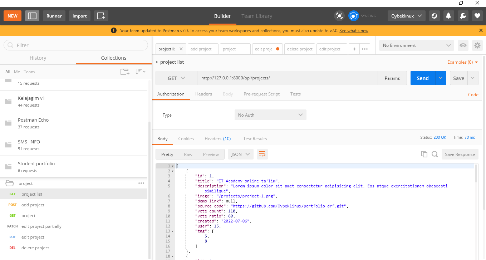
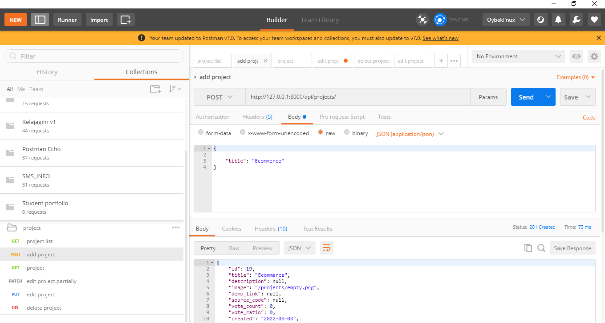
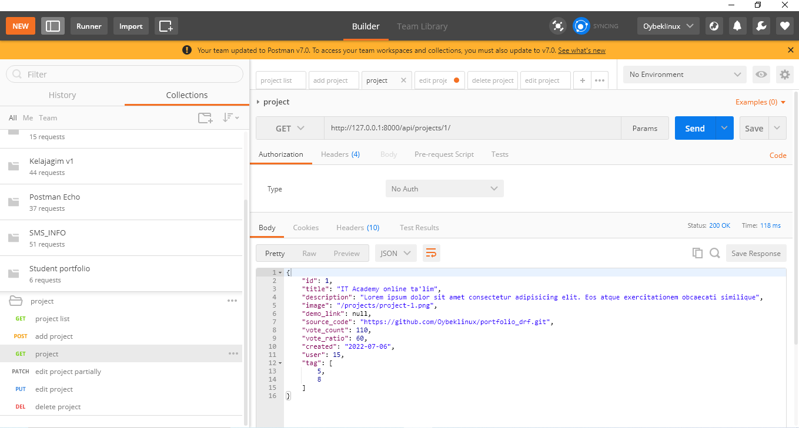
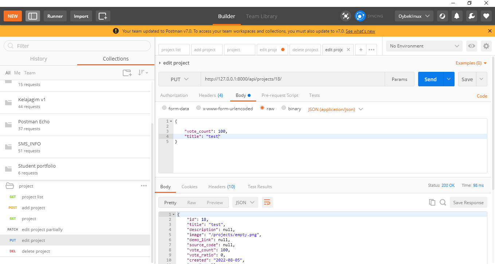
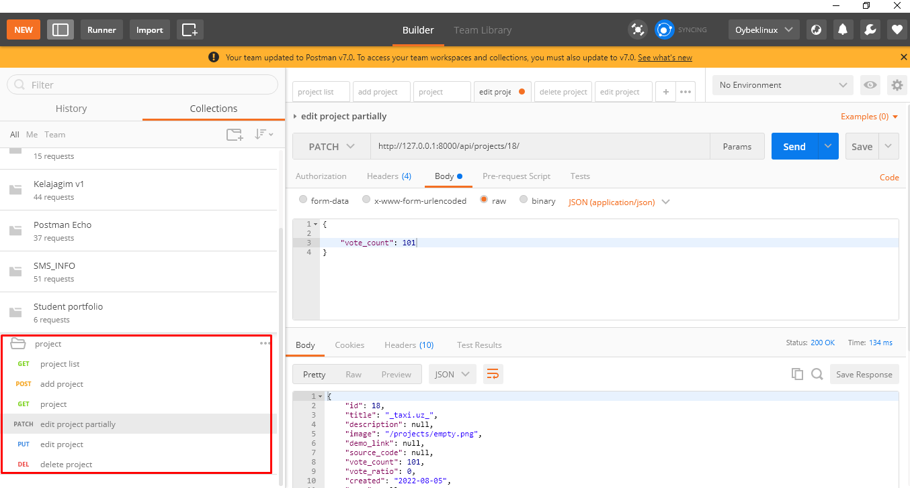
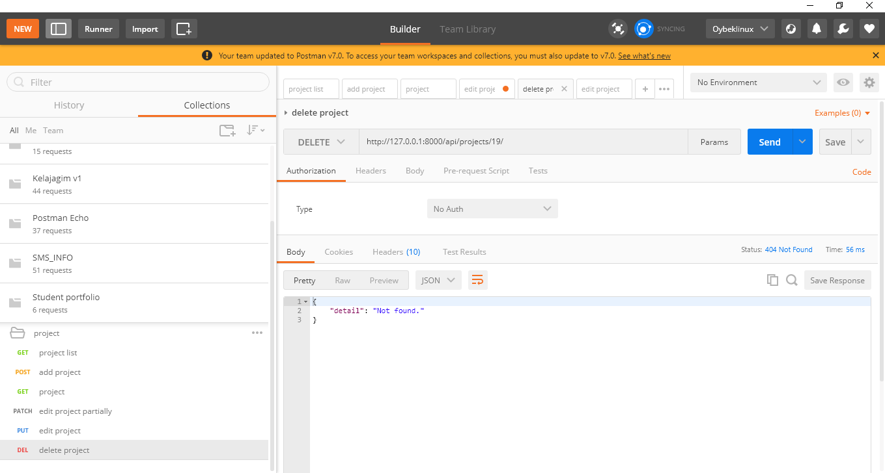
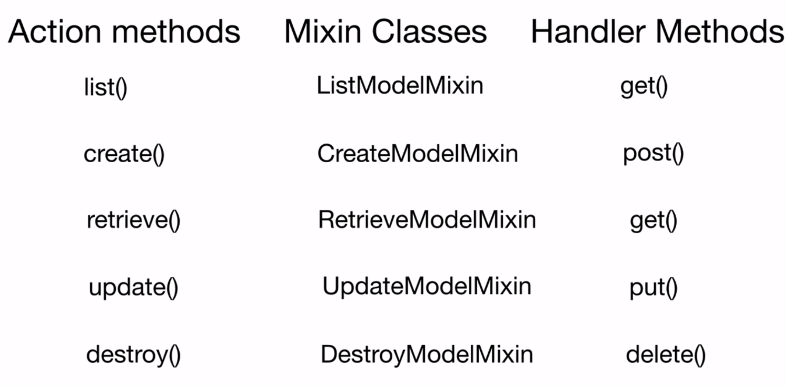
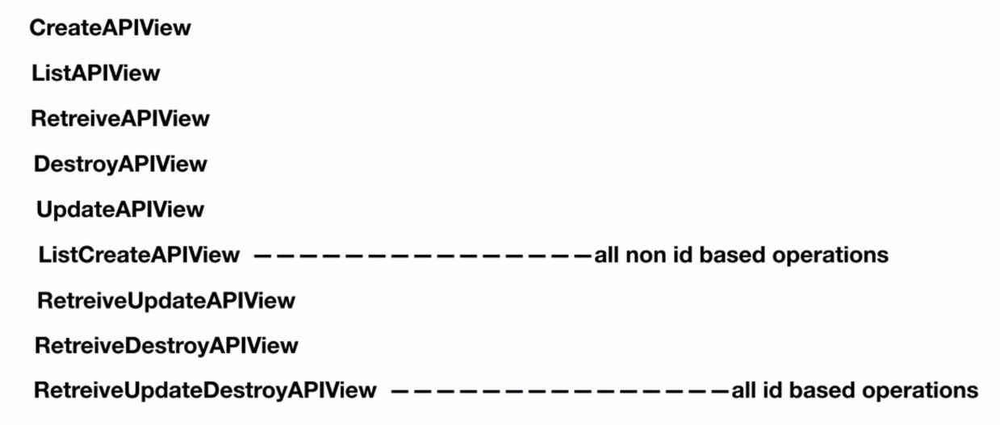

# Mavzu 8: Class View

## Reja:

1. [Bilim](#1-bilim)
   - [1.1 Terminlar](#11-terminlar)
   - [1.2 O'qish uchun materiallar](#12-oqish-uchun-materiallar)
2. [Amaliyot. O'qituvchi](#2-amaliyot-oqituvchi)
3. [Amaliyot. O'quvchi](#3-amaliyot-oquvchi)

## 1. Bilim

### 1.1 Terminlar

```

```

## 2. Amaliyot. O'qituvchi

**Reja:**

- [2.1 APIView]()
- [2.2 Mixin]()
- [2.3 Generic view]()
- [2.4 ViewSet]()

### 2.1 APIView

Avvalgi darsdagi api_view larni izohga olib qo'ying

1. Loyiha uchun CRUD amallarini bajaruvchi APIni APIView class yordamida bajaring

<p><b>views.py</b></p>

```python
from django.http import Http404
from rest_framework.views import APIView
from .models import Project
from .serializers import ProjectSerializer
from rest_framework.response import Response
from rest_framework import status


class Projects(APIView):

    def get(self, request):
        projects = Project.objects.all()
        serializer = ProjectSerializer(projects, many=True)
        return Response(serializer.data)

    def post(self, request):
        serializer = ProjectSerializer(data=request.data)
        if serializer.is_valid():
            serializer.save()
            return Response(serializer.data, status=status.HTTP_201_CREATED)
        return Response(serializer.errors, status=status.HTTP_400_BAD_REQUEST)


class ProjectDetail(APIView):

    def get_object(self, pk):
        try:
            return Project.objects.get(id=pk)
        except Project.DoesNotExist:
            raise Http404

    def get(self, request, pk):
        project = self.get_object(pk)
        serializer = ProjectSerializer(project)
        return Response(serializer.data)

    def put(self, request, pk):
        project = self.get_object(pk)
        serializer = ProjectSerializer(project, data=request.data)
        if serializer.is_valid():
            serializer.save()
            return Response(serializer.data)
        return Response(serializer.errors, status=status.HTTP_400_BAD_REQUEST)

    def patch(self, request, pk):
        project = self.get_object(pk)
        serializer = ProjectSerializer(project, data=request.data, partial=True)
        if serializer.is_valid():
            serializer.save()
            return Response(serializer.data)
        return Response(serializer.errors, status=status.HTTP_400_BAD_REQUEST)

    def delete(self, request, pk):
        project = self.get_object(pk)
        project.delete()
        return Response(status=status.HTTP_204_NO_CONTENT)
```

<p><b>urls.py</b></p>

```python
from django.contrib import admin
from django.urls import path
from .views import *

urlpatterns = [
    path('projects/', Projects.as_view()),
    path('projects/<int:pk>/', ProjectDetail.as_view()),
]
```

Endi ishga tushirib, avvalgi darsda tayyorlab olgan Postmandagi APIlarni yana bir bor tekshirib chiqamiz. E'tibor bering bu gal PATCH metodi ham qo'shildi. Uni PUT dan farqi, unga biz PUT kabi hamma majburiy hususiyatlarni berishimiz shart emas, ixtiyoriy hususiyatlarni bitta yoki bir nechtasini bera olamiz, ya'ni qisman o'zgartirishdir

```text
python manage.py runserver
```

<b>Natija</b>: Postmanda

#### PK asoslanmagan view

##### GET



##### POST



#### PK ga asoslangan view

##### GET



##### PUT



##### PATCH



##### DELETE



### 2.2 Mixin



Avvalgi kodlarni (APIView) izohga olib qo'ying

2. Loyiha uchun CRUD amallarini bajaruvchi APIni Mixin class yordamida bajaring

```python
from .models import Project
from .serializers import ProjectSerializer
from rest_framework import mixins, generics


class Projects(mixins.ListModelMixin, mixins.CreateModelMixin, generics.GenericAPIView):
    queryset = Project.objects.all()
    serializer_class = ProjectSerializer

    def get(self, request):
        return self.list(request)

    def post(self, request):
        return self.create(request)


class ProjectDetail(mixins.RetrieveModelMixin, mixins.UpdateModelMixin, mixins.DestroyModelMixin, generics.GenericAPIView):
    queryset = Project.objects.all()
    serializer_class = ProjectSerializer

    def get(self, request, pk):
        return self.retrieve(request, pk)

    def put(self, request, pk):
        return self.update(request, pk)

    def delete(self, request, pk):
        return self.destroy(request, pk)

```

ishga tushiramiz, so'ng Postmanda APIlarni tekshiramiz. urls.py faylida hech qanday o'zgarish bo'lmaydi

### 2.3 Generic view



Avvalgi kodlarni (Mixin) izohga olib qo'ying

3. Loyiha uchun CRUD amallarini bajaruvchi APIni Generic view class yordamida bajaring

```python
from .models import Project
from .serializers import ProjectSerializer
from rest_framework import generics


class Projects(generics.ListCreateAPIView):
    queryset = Project.objects.all()
    serializer_class = ProjectSerializer


class ProjectDetail(generics.RetrieveUpdateDestroyAPIView):
    queryset = Project.objects.all()
    serializer_class = ProjectSerializer
```

Ko'rib turganingizdek, kodlar yanada qisqardi

Serverni ishga tushiramiz, so'ng Postmanda APIlarni tekshiramiz. urls.py faylida hech qanday o'zgarish bo'lmaydi

### 2.4 ViewSet

Avvalgi kodlarni (Generics) izohga olib qo'ying

4. Loyiha uchun CRUD amallarini bajaruvchi APIni ViewSet view class yordamida bajaring

```python
from .models import Project
from .serializers import ProjectSerializer
from rest_framework import viewsets


class ProjectViewSet(viewsets.ModelViewSet):
    queryset = Project.objects.all()
    serializer_class = ProjectSerializer
```

<p><b>urls.py</b></p>

```python
from django.contrib import admin
from django.urls import path, include
from .views import *
from rest_framework.routers import DefaultRouter

router = DefaultRouter()
router.register('projects', ProjectViewSet)

urlpatterns = [
    path('', include(router.urls))
    # path('projects/', Projects.as_view()),
    # path('projects/<int:pk>/', ProjectDetail.as_view()),

]
```

Ko'rib turganingizdek, kodlar yanada qisqardi

Serverni ishga tushiramiz, so'ng Postmanda APIlarni tekshiramiz. urls.py faylida hech qanday o'zgarish bo'lmaydi

## 3. Amaliyot. O'quvchi

1. Hamma modellar uchun APIView yordamida CRUD APIlarini yozib chiqing
2. Hamma modellar uchun Mixin yordamida CRUD APIlarini yozib chiqing
3. Hamma modellar uchun Generics yordamida CRUD APIlarini yozib chiqing
4. Hamma modellar uchun ViewSet yordamida CRUD APIlarini yozib chiqing
