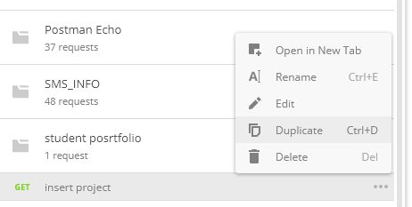
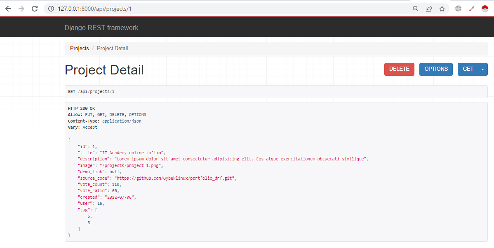
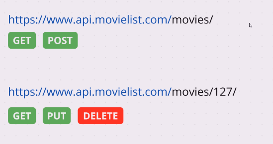
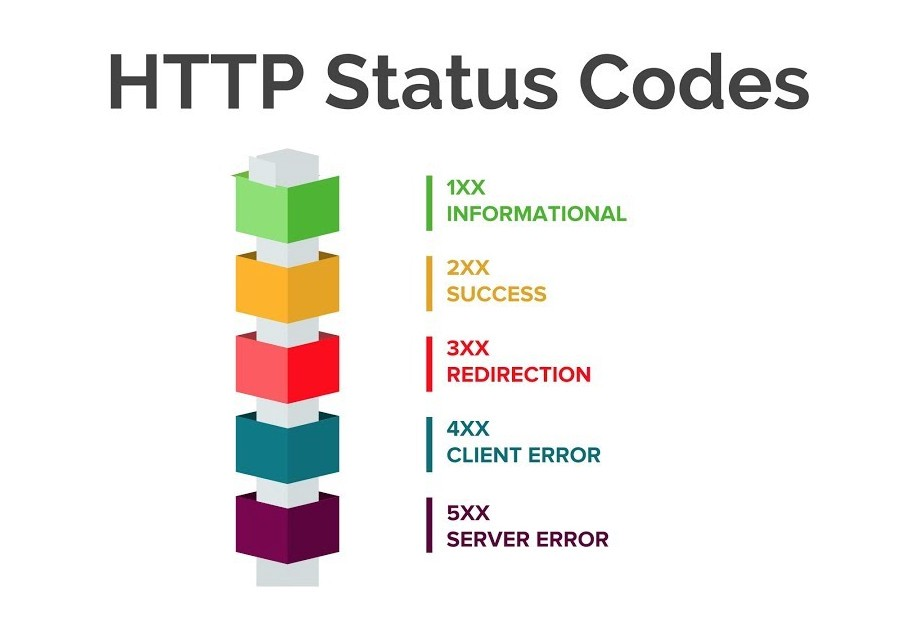

# Mavzu 9: Serializer. Pagination. Filtering. Security

## Reja:

1. [Bilim](#1-bilim)
   - [1.1 Terminlar](#11-terminlar)
   - [1.2 O'qish uchun materiallar](#12-oqish-uchun-materiallar)
2. [Amaliyot. O'qituvchi](#2-amaliyot-oqituvchi)
3. [Amaliyot. O'quvchi](#3-amaliyot-oquvchi)

## 1. Bilim

### 1.1 Terminlar

```

```

## 2. Amaliyot. O'qituvchi

**Reja:**

- [2.1 Serializer](#21-serialayzer)
  - [2.1.1 Tarmoqli serializer](#211-tarmoqli-serializer)
  - [2.1.2 Metod qo'shish](#212-metod-qoshish)
  - [2.1.3 Validatsiya](#213-validatsiya)
- [2.2 Sahifalash - pagination](#22-sahifalash---pagination)
  - [2.2.1 PageNumberPagination](#221-pagenumberpagination)
    - [2.2.1.1 Global daraja](#2211-global-daraja)
    - [2.2.1.2 Class daraja](#2212-class-daraja)
  - [2.2.4 LimitOffsetPagination](#224-limitoffsetpagination)
- [2.3 Filtrlash - filter](#23-filtrlash---filter)
  - [2.3.1 Filtrlash - Filter](#231-filtrlash---filter)
  - [2.3.2 Qidirish - Search](#232-qidirish---search)
  - [2.3.3 Tartiblash - Order](#233-tartiblash---order)

### 2.1 Serialayzer

#### 2.1.1 Tarmoqli serializer

##### Masala 1

Masala shuki, bazada muallif va kitob modeli bor. Shunday API kerakki unda hamma mualliflarni qaytarsin, har bir muallif bilan birga u maulliflarga tegishli kitoblar ro'yxatini ham qaytarsin

Qadamlar:

1. Yangi loyiha ochamiz. Nomi: books
2. Yangi model (class/jadval) ochamiz
3. Yangi tarmoqli serialayzer yozamiz
4. Classga asoslangan view yozamiz
5. URL marshrutlarni yozamiz
6. Browzerda va Postman da test qilamiz

##### Qadam 1

```text
>>> django-admin startproject books .
>>> python manage.py startapp product
```

<b>settings.py</b>

```python
INSTALLED_APPS = [
    'django.contrib.admin',
    'django.contrib.auth',
    'django.contrib.contenttypes',
    'django.contrib.sessions',
    'django.contrib.messages',
    'django.contrib.staticfiles',
    'rest_framework',
    'product.apps.ProductConfig'
]
```

##### Qadam 2

<b>product/models.py</b>

```python
from django.db import models


# Create your models here.
class Author(models.Model):
    first_name = models.CharField(max_length=50)
    last_name = models.CharField(max_length=50)


class Book(models.Model):
    title = models.CharField(max_length=50)
    rating = models.IntegerField()
    author = models.ForeignKey(Author, on_delete=models.CASCADE, related_name="books")
```

##### Qadam 3

<b>product/serializers.py</b>

```python
from rest_framework import serializers
from .models import *


class BookSerializer(serializers.ModelSerializer):
    class Meta:
        model = Book
        fields = '__all__'


class AuthorSerializer(serializers.ModelSerializer):
    books = BookSerializer(read_only=True, many=True)

    class Meta:
        model = Author
        fields = '__all__'
```

##### Qadam 4

<b>product/views.py</b>

```python
from .models import *
from .serializers import *
from rest_framework import generics


class AuthorListView(generics.ListCreateAPIView):
    queryset = Author.objects.all()
    serializer_class = AuthorSerializer


class AuthorDetailView(generics.RetrieveUpdateDestroyAPIView):
    queryset = Author.objects.all()
    serializer_class = AuthorSerializer


class BookListView(generics.ListCreateAPIView):
    queryset = Book.objects.all()
    serializer_class = BookSerializer


class BookDetailView(generics.RetrieveUpdateDestroyAPIView):
    queryset = Book.objects.all()
    serializer_class = BookSerializer
```

##### Qadam 5

<b>books/urls.py</b>

```python
from django.contrib import admin
from django.urls import path, include

urlpatterns = [
    path('admin/', admin.site.urls),
    path('api/', include('product.urls')),
]
```

<b>product/urls.py</b>

```python
from django.urls import path
from .views import *

urlpatterns = [
    path('books/', BookListView.as_view()),
    path('books/<int:pk>', BookDetailView.as_view()),
    path('authors/', AuthorListView.as_view()),
    path('authors/<int:pk>', AuthorDetailView.as_view()),
]
```

##### Qadam 6

```text
>>> python manage.py makemigrations
>>> python manage.py migrate
>>> python manage.py runserver
```

Quyidagi mualliflarni kiriting:

```text
  1. Abdulhamid Choʻlpon
  2. Abdulla Qodiriy
```

Quyidagi kitoblarni kiritib chiqing:

```text
  1. Abdulhamid Choʻlpon
    {
        "title": "Kecha va kunduz",
        "rating": 50,
    },
    {
        "title": "Vayronalar orasidan",
        "rating": 100,
    }
  2. Abdulla Qodiriy
    {
        "title": "Oʻtkan kunlar",
        "rating": 150,
    },
    {
        "title": "Mehrobdan chayon",
        "rating": 200,
    },
    {
        "title": "Obid ketmon",
        "rating": 60,
    }
```

Natija:


##### Masala 2

Loyihalar API sidan kelayotgan userni id emas, balki obyekt ko'rinishida qaytarish kerak



```python
class ProjectSerializer(serializers.ModelSerializer):
    user = UserForProjectSerializer(many=False)

    class Meta:
        model = Project
        fields = '__all__'
```

Natija:


##### Masala 3

Loyihalar API sidan kelayotgan tag id lari ro'yxatini o'rniga tag obyektlari ro'yxatini qaytarish kerak


```python
class ProjectSerializer(serializers.ModelSerializer):
    user = UsersSerializer(many=False)
    tag = TagSerializer(many=True)

    class Meta:
        model = Project
        fields = '__all__'
```


#### 2.1.2 Metod qo'shish

##### Masala 4

Loyihalar API sidan shu loyihaga berilgan fikrlar (Review) ham qaytsin
<br>
<br>
Endi bu metodni yozib SerializerMethodField yordamida hususiyat kabi chiqaradigan qilamiz:

```python
class ProjectSerializer(serializers.ModelSerializer):
    user = UsersSerializer(many=False)
    tag = TagSerializer(many=True)
    reviews = serializers.SerializerMethodField()

    class Meta:
        model = Project
        fields = '__all__'

    def get_reviews(self, obj):
        reviews = obj.review_set.all()
        serializer = ReviewSerializer(reviews, many=True)
        return serializer.data
```

Natija:


#### 2.1.3 Validatsiya

##### Built-in validatsiya

Bular model orqali beriladi. Masalan

```python
from django.db import models
from users.models import Profile


class Skill(models.Model):
    name = models.CharField(max_length=100)
    description = models.TextField()
    created = models.DateField(auto_now_add=True)
    user = models.ForeignKey(Profile, on_delete=models.SET_NULL, null=True, related_name="user_skills")

```

1. name hususiyatiga 10 tadan oshiq harflar kiritib ko'ring, xatolik beradi. Chunki max_length=10
2. description hususiyatini bo'sh qoldirib kiritib ko'ring xatolik beradi

Yuqoridagilar cheklovlar validaysiya ro'lini bajaradi


Cheklovlar ko'p, ulardan yana ba'zilarini keltiramiz:

3. blank=True - qiymat bo'sh bo'lsa, bo'sh satrni oladi
4. null=True - bazada null qiymat saqlanishi mumkin

##### Validatsiya yozish

##### Hususiy validatsiya

Qiymatni shartga tekshiradigan qilish uchun serializer ga yozsak bo'ladi. Qachonki is_valid() metodi chaqirilganda mana shu metodlar ishga tushadi.
Uni yozish uchun nomlanish qoidasiga rioya qilish kerak. Yozilgna metod quyidagicha bo'lishi kerak:

```text
def validate_hususiyat(self, value):
    ...
```

Masala 1. Skill jadvaliga kiritilayotgan malaka nominida son bo'lmasin. Endi bu shartni tekshiradigan qilish uchun SkillSerializer ga qo'shimcha metod yozamiz:

```python
import re
from rest_framework import serializers
from .models import Skill


class SkillSerializer(serializers.ModelSerializer):
    class Meta:
        model = Skill
        fields = '__all__'

    def validate_name(self, value):
        if re.search('\d', value):
            raise serializers.ValidationError('Malaka nomida son kelmasin')
        return value
```

Natija:


##### Umumiy validatsiya

Umumiy validatsiya validate() metodida yoziladi:

```python
from rest_framework import serializers
from .models import Skill
from users.serializers import *
import re


class SkillSerializer(serializers.ModelSerializer):
    class Meta:
        model = Skill
        fields = '__all__'

    def validate(self, data):
        if re.search('\d', data['name']):
            raise serializers.ValidationError('Malaka nomida son kelmasin')
        if 1 < len(data['description']) < 10:
            raise serializers.ValidationError('Tavsif 10 harfdan kam bo''lmasin')
        data['name'] = data['name'].lower()
        return data
```

Natija:




### 2.2 Sahifalash - pagination

#### 2.2.1 PageNumberPagination

Avvalgi books loyihasini davvom ettiramiz

##### 2.2.1.1 Global daraja

Sahifalashni global e'lon qilish uchun settings.py ga quyidagi yangi yozuvlarni kiritamiz. Bu holda setting.py faylidagi pagination sozlamalari hamma Generic view va ViewSet classlariga tasir qiladi. Mixin va APIVIEW larda uni alohida ko'rsatish kerak bo'ladi

<b>settings.py</b>

```python
# ... bu yerda kodlar bor

REST_FRAMEWORK = {
    'DEFAULT_PAGINATION_CLASS': 'rest_framework.pagination.PageNumberPagination',
    'PAGE_SIZE': 2
}

# ... bu yerda kodlar bor
```

Izoh:

- PAGE_SIZE - bitta sahifada obyektlar soni. Ya'ni mazkur holatda bitta sahifada 2 ta kitob bo'ladi
- DEFAULT_PAGINATION_CLASS - pagination classni ko'rsatish uchun ishlatiladi.
- PageNumberPagination - Bu class ni ishlatsak, url http://127.0.0.1:8000/api/books/?page=2 ko'rinishda bo'ladi, ya'ni faqat sahifani raqami beriladi

Ishga tushirib bravzerdan api/books/ va api/authors/ apilariga kirazmi

Natija:


##### 2.2.1.2 Class daraja

Class darajada pagination sozlamalari settings.py faylida emas, balki class (genericview, ViewSet) ichida beriladi
<br>
Hozirgi holatda mualliflar ham sahifalanib chiqadi:


1. Endi faqatgina api/authors/ APIsidan paginationni olib tashlaymiz. Buning uchun AuthorListView classida pagination_class = None deb yozamiz

<b>product.views.py</b>

```python
class AuthorListView(generics.ListCreateAPIView):
    queryset = Author.objects.all()
    serializer_class = AuthorSerializer
    pagination_class = None
```

Natija:


2. Faqatgina api/authors/ APIsida sahifalash boshqacha bo'lsin. Masalan bitta sahifada bitta obyekt bo'lsin. Buning uchun alohida PageNumberPagination classdan voris bo'lgan class yozamiz. Keyin uni AuthosListView classining pagination_class hususiyatiga yozamiz

```python

from .serializers import *
from rest_framework import generics
from rest_framework.pagination import PageNumberPagination


class AuthorPagination(PageNumberPagination):
    page_size = 1


class AuthorListView(generics.ListCreateAPIView):
    queryset = Author.objects.all()
    serializer_class = AuthorSerializer
    pagination_class = AuthorPagination

```

Natija:


#### 2.2.4 LimitOffsetPagination

3. Faqatgina api/authors APIsida bitta sahifada nechta obyekt bo'lishini klient tarafidan ko'rsata olsin. Buning uchun LimitOffsetPagination ni pagination_class ga ko'rsatamiz.

```python
from rest_framework.pagination import PageNumberPagination, LimitOffsetPagination


class AuthorListView(generics.ListCreateAPIView):
    queryset = Author.objects.all()
    serializer_class = AuthorSerializer
    pagination_class = LimitOffsetPagination

```

Bizda settings.py faylida PAGE_SIZE da 2 soni berilgna, bizda ham 2ta muallif bor, keyingi sahifa havolasini ko'rish uchun yana bitta muallif kiritamiz:


Natijani ko'ramiz:


### 2.3 Filtrlash - filter

Django da Filter ga filtr, tartiblash, qidirish funksiyalari kirib ketadi, bularni quyida birin ketin ko'rib o'tamiz. Bularni ham yuqoridagidek global va class darajasida sozlash mumkin. Endi ularni alohida yozib o'tirmaymiz
<br>
Izoh:

- filter - bu ayni shu qiymatga teng bo'lganlarni topib beradi
- search - berilgan qiymat ko'rsatilgan hususiyatning boshida , ohirida, orasida kelganlarni qidirib topib beradi
- order - o'sish yoki kamayish tartibida chiqarib beradi

#### 2.3.1 Filtrlash - Filter

Filterni ishlatish uchun uni avval o'rnatib olamiz

```text
>>> pip install django-filter
```

<b>settings.py</b>

```python
INSTALLED_APPS = [
    'django.contrib.admin',
    'django.contrib.auth',
    'django.contrib.contenttypes',
    'django.contrib.sessions',
    'django.contrib.messages',
    'django.contrib.staticfiles',
    'rest_framework',
    'product',
    'django_filters'
]
```

4. books loyihasida hamma APIlarni filterlash imkoni bo'lsin. Mualliflarni hamma hususiyati bo'yicha, kitobni esa faqat title bo'yicha filtrlasin

<b>settings.py</b>

```python
REST_FRAMEWORK = {
    'DEFAULT_PAGINATION_CLASS': 'rest_framework.pagination.PageNumberPagination',
    'PAGE_SIZE': 2,
    'DEFAULT_FILTER_BACKENDS': ['django_filters.rest_framework.DjangoFilterBackend']
}
```

Bu yerda filter global qilib e'lon qilindi. Endi Har bir classga alohida qaysi hususiyati bo'yicha filtrlash kerakligini ko'rsatamiz

<b>product/views.py</b>

```python
# ...

class AuthorListView(generics.ListCreateAPIView):
    queryset = Author.objects.all()
    serializer_class = AuthorSerializer
    pagination_class = LimitOffsetPagination
    filterset_fields = '__all__'

# ...

class BookListView(generics.ListCreateAPIView):
    queryset = Book.objects.all()
    serializer_class = BookSerializer
    filterset_fields = ['title']

# ...
```

Izoh:

- filterset_fields - bu yerga filtrlash uchun modelning hususiyati ko'rsatiladi

Mualliflarni hamma hususiyati bo'yicha filtrlasin deb yozdik (filterset_fields = '**all**')
<br>
Kitoblarni esa faqat title bo'yicha filtrlasin deb yozdik (filterset_fields = ['title'])

Natija:

Mualliflarni filtrlash


Kitoblarni filtrlash



Muallif ismi bo'yicha filtrlaymiz



#### 2.3.2 Qidirish - Search

<br>Avval global darajada berib qo'yamiz<b>settings.py</b>
Qidirsh imkoniyatlari:

- '' - harfa katta kichikligidan qat'iy nazar qidiradi
- '^' - boshidan qidiradi
- '=' - ayni teng bo'lganini qidiradi
- '@' - Katta matndan qidiradi FTS-Full text search deb nomlanadi va bu faqat PostgreSQL da ishlaydi
- '$' - regex usulida qidirish

```python
REST_FRAMEWORK = {
    'DEFAULT_PAGINATION_CLASS': 'rest_framework.pagination.PageNumberPagination',
    'PAGE_SIZE': 2,
    'DEFAULT_FILTER_BACKENDS': ['django_filters.rest_framework.DjangoFilterBackend', 'rest_framework.filters.SearchFilter']
}
```

5. Kitobni nomi orqali qidirish imkoni bo'lsin, lekin bu holda so'z sarlavha orasida, ohirida, boshida kelsa ham qaytarsin

<b>product/views.py</b>
Qaysi hususiyatlarni qidirish kerakligini search_fields hususiyatida ko'rsatib qo'yamiz

```python
class BookListView(generics.ListCreateAPIView):
    queryset = Book.objects.all()
    serializer_class = BookSerializer
    filterset_fields = ['title']
    search_fields = ['title']
```

Ya'ni faqat title bo'yicha qidirsin

Natija:


6. Muallifning ismi va familiyasi bo'yicha qidirish imkoni bo'lsin

<b>product/views.py</b>

```python
# ...

class AuthorListView(generics.ListCreateAPIView):
    queryset = Author.objects.all()
    serializer_class = AuthorSerializer
    pagination_class = LimitOffsetPagination
    filterset_fields = '__all__'
    search_fields = ['first_name', 'last_name']

# ...
```

Natija:


'iy' harflarini berganda u ham ism ham sharifdan qidiradi

7. Muallif ismida yoki sharifi boshidan qidirsin

<b>product/views.py</b>

```python
# ...

class AuthorListView(generics.ListCreateAPIView):
    queryset = Author.objects.all()
    serializer_class = AuthorSerializer
    pagination_class = LimitOffsetPagination
    filterset_fields = '__all__'
    search_fields = ['^first_name', '^last_name']

# ...
```

Natija:

Agar 'qo' ni yozsak, Qodiriy ismida uchraydi


<br>

Agar 'iy' ni yozsak, hech qaysi ism yoki sharif boshida uchramaydi


#### 2.3.3 Tartiblash - Order

<br>Avval global darajada berib qo'yamiz<b>settings.py</b>

```python
REST_FRAMEWORK = {
    'DEFAULT_PAGINATION_CLASS': 'rest_framework.pagination.PageNumberPagination',
    'PAGE_SIZE': 2,
    'DEFAULT_FILTER_BACKENDS': ['django_filters.rest_framework.DjangoFilterBackend',
                                'rest_framework.filters.SearchFilter',
                                'rest_framework.filters.OrderingFilter']
}
```

Natijada bizda APIlarda tartiblash imkoni mavjud bo'ladi


<br>
Agar alohida ko'rsatmoqchi bo'lsak, u holda ordering_fields hususiyatida ko'rsatamiz

8. Kitoblarni nomi bo'yicha tartiblab bering

<b>product/views.py</b>

```python
# ...

class BookListView(generics.ListCreateAPIView):
    queryset = Book.objects.all()
    serializer_class = BookSerializer
    filterset_fields = ['title']
    search_fields = ['title']
    ordering_fields = ['title']

# ...
```

Natija:
<br>

<br>
Teskari tartiblash
<br>

<br>

### 2.4 Havfsizlik - security

## 3. Amaliyot. O'quvchi


Quyida portfolio bo'yicha vazifalar keltirilgan:

1. users/ API da foydalnuvchi va unga tegishli hamma loyihalar chiqsin
2. users_received_message/ API da foydalnuvchi va unga tegishli hamma unga yuborilgan habarlar chiqsin
3. users_sent_message/ API da foydalnuvchi va unga tegishli hamma u yuborgan habarlar chiqsin
4. project_review/ API da loyiha va unga berilgan hamma izohlar chiqsin
5. posrtfolio loyihasidagi hamma APIlar pagination bilan chiqsin
6. Faqatgin loyihalar APIsida sahifadagi loyihalar soni ko'rsatish imkoni bo'lsin
7. Habarlar APIsida bitta sahifadagi habarlar soni global page_size dan farqli bo'lsin
8. Loyihalarni nomi orqali qidirish imkoni bo'lsin
9. Habarlarni nomi va kontenti orqali qidirish imkoni bo'lsin
10. Loyihalar nomi bo'yicha tartiblash imkomi bo'lsin
11. Foydalanuvchilar nomi bo'yicha tartiblash imkomi bo'lsin
