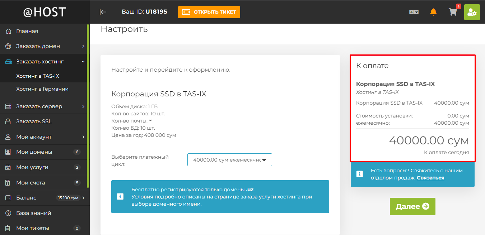
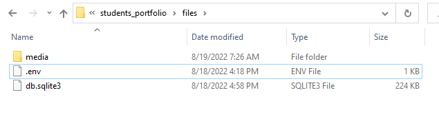
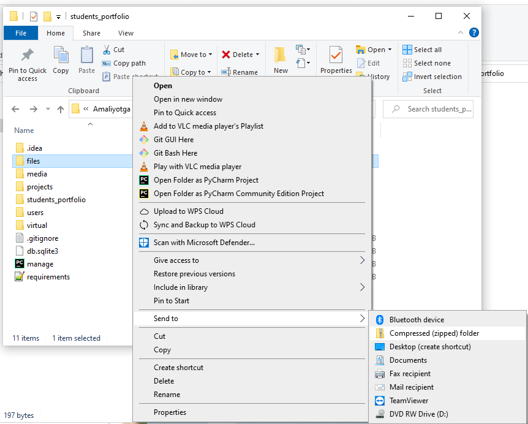
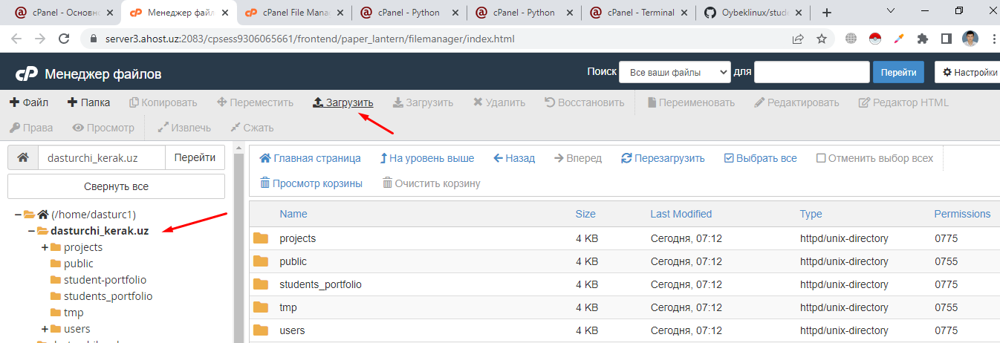
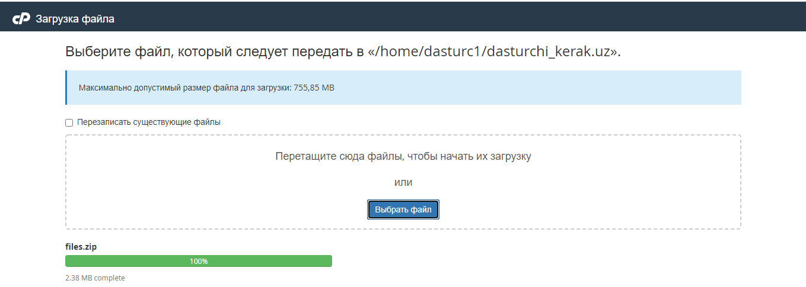
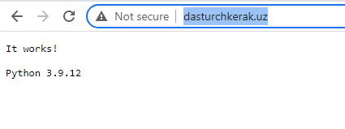
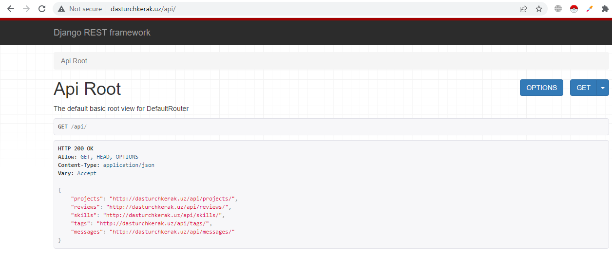
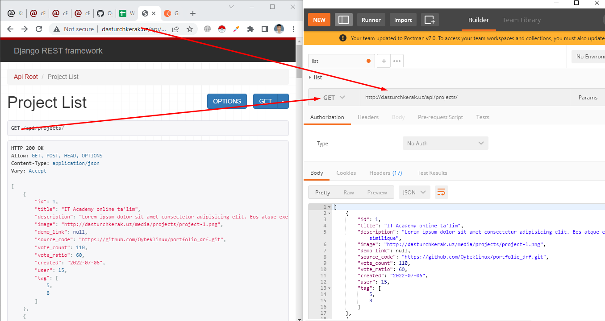
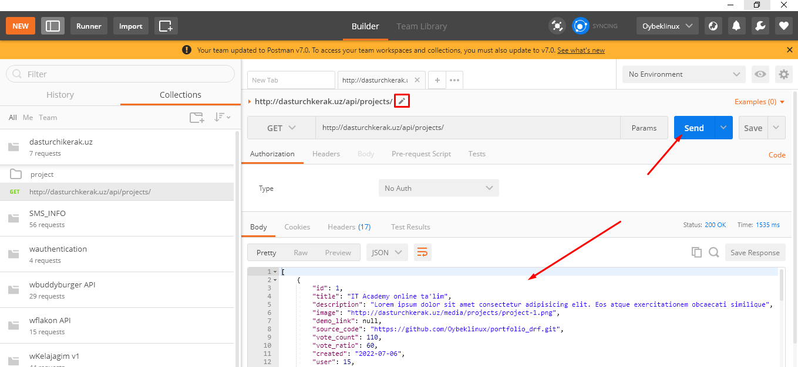
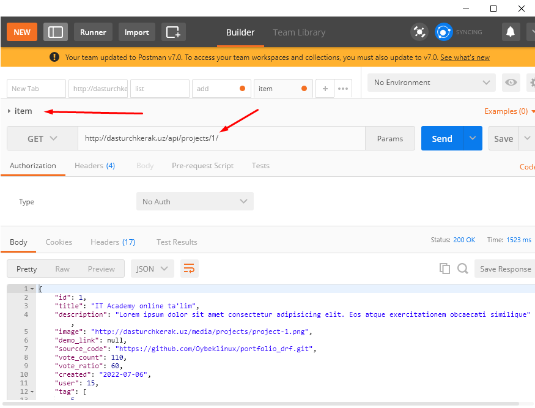

# Mavzu 10: Deploy

## Reja:

1. [Bilim](#1-bilim)
   - [1.1 Terminlar](#11-terminlar)
   - [1.2 O'qish uchun materiallar](#12-oqish-uchun-materiallar)
2. [Amaliyot. O'qituvchi](#2-amaliyot-oqituvchi)
3. [Amaliyot. O'quvchi](#3-amaliyot-oquvchi)

## 1. Bilim

### 1.1 Terminlar

```

```

## 2. Amaliyot. O'qituvchi

**Reja:**

- [2.1 Kutubhonalar](#21-kutubhonalar)
  - [2.1.1 Swagger](#211-swagger)
  - [2.1.2 CORS](#212-cors)
  - [2.1.3 whitenoise](#213-whitenoise)
  - [2.1.4 environ. debug, static, media sozlamalari](#214-environ-debug-static-media-sozlamalari)
- [2.2 github](#22-github)
- [2.3 ahost](#23-ahost)
  - [2.3.1 domen va hosting](#231-domen-va-hosting)
  - [2.3.2 virtual muhit](#232-virtual-muhit)
  - [2.3.3 Kutubhonalarni o'rnatish](#233-kutubhonalarni-ornatish)
  - [2.3.4 media, .env, db.sqlite](#234-media-env-dbsqlite)
  - [2.3.5 collectstatic](#235-collectstatic)
  - [2.3.6 ModSec](#236-modsec)
  - [2.3.7 Test. Postman](#237-test-postman)

### 2.1 Kutubhonalar

Agar API larni qisman bo'lsa ham yozib bo'lgan bo'lsangiz, unda serverga o'rnatishga kirishamiz

#### 2.1.1 Swagger

[Swagger](https://drf-yasg.readthedocs.io/en/stable/readme.html) - api hujjatlarini hosil qilib beradigan kutubhona. Front-end dasturchilarga juda kerakli hujjat. Uni o'rnatish uchun quyidagi qadamlarni amalga oshiramiz

1. Kutubhonani o'rnatish

```text
>>> pip install -U drf-yasg
```

2. Ro'yxatdan o'tkazish
<p><b>settings.py</b></p>

```text
INSTALLED_APPS = [
   ...
   'drf_yasg',
   ...
]
```

3. Marshrutni ko'rsatish
<p><b>urls.py</b></p>

```python
from django.contrib import admin
from django.urls import path, include, re_path
from rest_framework import permissions
from drf_yasg.views import get_schema_view
from drf_yasg import openapi

schema_view = get_schema_view(
   openapi.Info(
      title="Snippets API",
      default_version='v1',
      description="Test description",
      terms_of_service="https://www.google.com/policies/terms/",
      contact=openapi.Contact(email="contact@snippets.local"),
      license=openapi.License(name="BSD License"),
   ),
   public=True,
   permission_classes=[permissions.AllowAny],
)


urlpatterns = [
    path('admin/', admin.site.urls),
    path('api/', include('projects.urls')),
    re_path(r'^swagger(?P<format>\.json|\.yaml)$', schema_view.without_ui(cache_timeout=0), name='schema-json'),
    re_path(r'^swagger/$', schema_view.with_ui('swagger', cache_timeout=0), name='schema-swagger-ui'),
    re_path(r'^redoc/$', schema_view.with_ui('redoc', cache_timeout=0), name='schema-redoc'),
]
```

Ishga tushiramiz, natijada http://127.0.0.1:8000/swagger/ URLda API hujjatlarini ko'ramiz:


Endi bu havolani front-end dasturchiga berib bemalol birga ishlasa bo'ladi )

#### 2.1.2 CORS

Ta'rifi: Cross-Origin Resource Sharing (CORS) HTTP sarlavhasiga asoslangan mexanizm boʻlib, serverga oʻzidan boshqa har qanday manbalarni (domen, sxema yoki port) koʻrsatishga imkon beradi, undan brauzer resurslarni yuklashga ruxsat beradi.

Brauzerdan APIlardan foydalanishda quyidagi xatoliklar paydo bo'ladi:


Uni oldini olish uchun django-cors-headers kutubhonasini o'rnatamiz.
django-cors-headers - Bu kutubhona Cross-Origin Resource Sharing (CORS) header larini Response ga qo'shib beradi. Bu boshqa manbalardan Django ilovangizga brauzer ichidagi soʻrovlarni amalga oshirish imkonini beradi.

1. Kutubhonani o'rnatish

```text
>>> python -m pip install django-cors-headers
```

2. Ro'yxatdan o'tkazish

```text
INSTALLED_APPS = [
    ...,
    'corsheaders',
    ...,
]
```

3. Middleware ga qo'shish

```text
MIDDLEWARE = [
    ...,
    'corsheaders.middleware.CorsMiddleware',
    'django.middleware.common.CommonMiddleware',
    ...,
]
```

4. Hamma IPlarga ruhsat berish.
Bu havfsiz emas, lekin boshlanishiga shunday qilishingiz mumkin. To'liqroq ma'lumot [bu yerda](https://pypi.org/project/django-cors-headers/)
<p><b>settings.py</b></p>

```text
CORS_ALLOW_ALL_ORIGINS = True
```

### 2.1.3 whitenoise

[whitenoise](https://pypi.org/project/whitenoise/) - Ikki qatorli konfiguratsiya bilan veb-ilovangizga o'zining statik fayllariga xizmat ko'rsatishga imkon beradi, bu esa uni nginx, Amazon S3 yoki boshqa har qanday tashqi xizmatga tayanmasdan istalgan joyda o'rnatish mumkin bo'lgan mustaqil qurilmaga aylantiradi. (Ayniqsa, Heroku, OpenShift va boshqa PaaS provayderlarida foydali.)

1. Kutubhonani o'rnatish

```text
>>> pip install whitenoise
```

2. Ro'yxatdan o'tkazish

```text
INSTALLED_APPS = [
    'whitenoise.runserver_nostatic',
    'django.contrib.admin',
    ...
]
```

3. Middleware ga qo'shish

```text
MIDDLEWARE = [
    'django.middleware.security.SecurityMiddleware',
    'whitenoise.middleware.WhiteNoiseMiddleware',
    'django.contrib.sessions.middleware.SessionMiddleware',
    'corsheaders.middleware.CorsMiddleware',

    ...
]
```

#### 2.1.4 environ. debug, static, media sozlamalari

Ba'zi maxfiy fayllarni berkitish uchun o'zgaruvchilarni saqlab turadigan alohida fayldan foydalanish kerak bo'ladi. django-environ kutubhonasi shu maqsadda foydalaniladi, undan tashqari o'zgaruvchi ikki hil qiymat qabul qilishi mumkin bo'lganda ham bu kutubhonadan foydalanish mumkin

1. Kutubhonani o'rnatish

```text
>>> pip install django-environ
```

2. Sozlashlar

```text
import environ

BASE_DIR = Path(__file__).resolve().parent.parent

env = environ.Env(
    DEBUG=(bool, True),
    STATIC_ROOT=(str, os.path.join(BASE_DIR, 'static')),
    MEDIA_ROOT=(str, os.path.join(BASE_DIR, 'media'))
)
environ.Env.read_env()

SECRET_KEY = env('SECRET_KEY')

DEBUG = env('DEBUG')
```

3. .env nomli fayl ochamiz. Bu fayl settings.py joylashgan kataloga bo'ladi


Bu fayl lokal kompyuterda boshqacha serverda boshqacha bo'ladi

- lokal kompyuterdagi .env:

```text
SECRET_KEY=django-insecure-u6wol)l1+50a1*nk2fuse!@cr8b1m8@l_)8g0x6wkkmd4)-3bn
```

- serverdagi .env:

```text
SECRET_KEY=django-insecure-u6wol)l1+50a1*nk2fuse!@cr8b1m8@l_)8g0x6wkkmd4)-3bn
DEBUG=False
STATIC_ROOT=/home/dasturc1/dasturchikerak.uz/static/
MEDIA_ROOT=/home/dasturc1/dasturchikerak.uz/media/
```

Bu qiymatlar sizda boshqacha bo'ladi, o'zingizga moslashtirib olasiz
DEBUG=True holatda xatolik yuz berganda xatolarni kodlar bilan ko'rsatadi, bu dasturchi uchun kerak, lekin mijoz uchun emas, bularni berkitish uchun DEBUG=False bo'lishi kerak, shuningdek Debug=True holatida hotiradan ko'proq joy egallaydi.

### 2.2 github

#### 2.2.1 gitignore

Avval .gitignore fayliga maxfiy bo'lgan (kalitlar) yoki o'zgaruvchan fayllarni (MB) yoki kodga aloqasi bo'lmagan fayllarni (virtual muhit) qo'shib qo'yamiz

<p><b>.gitignore</b></p>

```text

...

db.sqlite
virtual
media
.env
static

...
```

#### 2.2.1 gitignore

#### 2.2.2 github

Endi github yuklaymiz.

1. Repozitoriy ochamiz


2. Nom beramiz


3.  Tugmani bosamiz


4. Lokal kompyuterimizda terminal orqali loyiha joylashgan katalogga o'tamiz. Son'g quyidagi buyruqlarni yozamiz

```text
>>> git init
>>> git add .
>>> git config user.name "Ismingiz"
>>> git config user.email "pochta@gmail.com"
>>> git commit -m "init"
>>> git remote add origin https://github.com/Oybeklinux/dasturchikerak.git
>>>  git push --set-upstream origin master
```

Natijada loyihamiz githubga yuklanadi:


### 2.3 ahost

ahost - bu hosting, shuningdek domen sotib olish ham mumkin
Loyihamizni serverga joylashtirish uhcun ahost misolida ko'ramiz.
Avval [quyidagi havola](https://clients.ahost.uz/register.php) orqali ro'yxatdan o'tamiz


Ro'yxtdan o'tgach shaxsiy kabinetga [login](https://clients.ahost.uz/login) qilamiz


#### 2.3.1 domen va hosting

Hosting tanlash uchun quyidagi havolani bosamiz, so'ng tariflardan birini tanlaymiz. 500MB joy ham yetarli bo'ladi. 1GB bo'lsa undan ham yaxshi )


So'ng yangi nom beramiz, ya'ni domen nomini yozamiz, so'ng tekshiramiz, agar bo'sh bo'lsa, unda keyingi sahifaga o'tish tugmasini bosamiz


Bizga narini chiqarib beradi. Keyingi sahifaga o'tib, to'lovni amalga ishiramiz. 1 kungacha bizga domendan foydalanishga ruhsat keladi.


#### 2.3.2 virtual muhit

Ruhsat berilgandan keyin qayta login qilamiz. Quyidagi menyuni tanlab, 'Управление' tugmasini bosamiz.


"Вход в cPanel" tugmasini bosamiz


Bu yerdan 3 menyuni ochib qo'yamiz

1. Менеджер файлов
2. Python
3. Terminal


Endi Python ga o'tib yangi virtual muhit ochamiz:

1. Python versiyasini tanlaymiz
2. Virtual muhitga nom beramiz.(Rasmda dasturchikerak.uz nomi berilgan)
3. Log yozuvlari yoziladigan yo'lni va fayl nomini yozamiz (shart emas)
4. "СОЗДАТЬ" tugmasini bosamiz

Natijada yangi virtual muhit paydo bo'ladi.


Loyihada biron kod o'zgarsa, kuchga kirish uchun uni yuqoridagi rasmda ko'rsatilganidek yangilash tugmasini bosish kerak bo'ladi.


Endi terminalda virtual muhitni ishga tushirish uchun uni yo'lini ko'chirib olish kerak. Uning uchun quyidagilarni amalga ochiramiz:

1. Qalamcha belgini bosamiz


2. So'ng virtual muhitni ustiga borib, sichqoncha bilan bossak, uni yo'li buferga ko'chiriladi


Agar brouzerga domenni nomini kiritsangiz. Python haqida habarni ko'rasiz, bu degani birinchi bo'lib loyiha kalatogidagi (ya'ni dasturchikerak.uz) passenger_wsgi.py faylini ishga tushiradi. Keyinroq biz bu faylga django loyihani ishga tushiradigan qilib o'zgartiramiz

3. Terminalga tashlab, ENTER ni bosamiz


##### loyihani ko'chirish

1. Endi loyihani ko'chirish uhcun avval uni yo'lini ko'chirib olamiz


2. So'ng quyidagi buyruqni yozib, buferdagini tashlab ENTER ni bosamiz (siz o'zingizni loyihangizni yozasiz):

```text
>>> git clone https://github.com/Oybeklinux/student-portfolio.git
```

Natijada loyiha ko'chiriladi


3. Buyruqlar bilan tanishamiz:

- ls - fayl va kataloglarni ko'rsatadi
- cd .. - bitta tepaga chiqadi
- cd temp - temp katalogiga o'tadi
- mkdir - yangi katalog ochadi
- pwd - qayerdaligini chiqaradi
- ls -lah - hamma narsani ko'rsatadi, berkitilganlarini ham
- mv temp temp1 - temp katalogini nomini temp1 ga o'zgartirish
- mc - midnight comander dasturi (Total comander ga o'xshaydi)
- cat passenger_wsgi.py - passenger_wsgi.py ichini ko'rsatadi
- nano passenger_wsgi.py - passenger_wsgi.py faylini o'zgartirish uchun nano dasturini ochib beradi
- F2 - saqlash uchun
- F10 - chiqish uchun
- F5 - ko'chirish uchun
- F6 ko'chirib o'tkazish uchun

4. Buyruqlar bilan tanishib o'tgan bo'lsak, endi hozirgina clone qilgan loyihani katalog ichidagilarini tashqariga ko'chirib o'tamiz, ya'ni manage.py faylimiz to'g'ridan to'g'ri dasturchikerak.uz ichida bo'lishi kerak. Buning uchun quyidagilarni amalga oshiring:
   - mc ni yozib ENTER ni bosamiz.
   - So'ng oynani chap tarafidan loyiha katalogiga kirib hamma faylni belgilang (klaviaturadagi insert bilan)


- F6 ni bosing. O'ng tarafga ko'chirib o'tadi
- Bo'sh katalogni o'chirib tashlang, agar bo'lsa


#### 2.3.3 Kutubhonalarni o'rnatish

Kutubhonalarni o'rnatish uchun quyidagi buyruqni yozamiz.

```text
>>> pip install -r requirements.txt
```

Agar loyihangizda requirements.txt bo'lmasa, lokalga o'tib unda quyidagilarni bajaring

```text
>>> pip freeze > requirements.txt
>>> git add .
>>> git commit -m "requirement qo'shildi"
>>> git push
```

Serverga o'tib :

```text
>>> git pull
```

Mana endi yuqoridagi buyruqni yozing:

```text
>>> pip install -r requirements.txt
```

#### 2.3.4 media, .env, db.sqlite

Bazani ko'chirib o'tish mumkin yoki shunchaki migrate buyrug'ini yozsangiz, yangi baza ochib beradi. Qaysi biri qulay bo'lsa shuni qo'llaysiz. (Bu yerda ko'rsatilgan bazani ko'chirish faqat SQLite uchun)
<br>
.gitignore ga kiritilgan fayllarni ahost ga o'tkazish uhcun avval ularni quyidagilarni amalga oshiramiz
<br>

1. Fayllarni ziplab olamiz
   <br>
   Fayl joylash katalogga o'tamiz


Alohida files degan katalog ochib hamma kerakli fayl va kataloglarni unga ko'chiramiz



So'ng ziplaymiz



2. files.zip ni ahostga o'tkazamiz (files katalogi o'chirib tashlashingiz mumkin)
   <br>

Loyiha joylashgan katalogga kirib, "Загрузить" ni bosib, files.zip faylni ko'rsatamiz






Keyin files.zip ni zipdan chiqarib, fayl va kataloglarni mc orqali joy-joyiga qo'yamiz, huddi loyihada joylashganidek. files va files.zip ni o'chirib tashlasa ham bo'ladi
<br>
Natija quyidagicha bo'ladi:


.env ni ahostga ko'chirib bo'lgach, lokal kompyuterdagi .env ichidagi, DEBUG, STATIC_ROOT, MEDIA_ROOT o'zgaruvchilarini o'chiramiz, bu sozlamalar serverga hos edi, lokal uchun settings.py da berilgan

#### 2.3.5 collectstatic

Endi statik fayllarni hosil qilamiz:

```text
>>> python manage.py collectstatic
```

Endi http://dasturchkerak.uz domenga kirib tekshirib ko'ramzi:



http://dasturchkerak.uz/api/ ga kiramiz:



#### 2.3.6 ModSec

O'chirish, o'zgartirish funksiyalari ishlamayotgan bo'lsa, cPanel da ModSecure bo'limiga kirib ruhsat berib qo'yamiz:


"Выкл." tugamsini bosing, natijada quyidagi holatda bo'ladi:


#### 2.3.7 Test. Postman

Endi browzerdan qiymatlar kiritib, o'chirib, o'zgartirib ko'ring. Huddi shu ishni Postman dasturida qiling

<br>

Avval yangi kolleksiya ochib, nom beramiz:


##### Project API

###### GET

1. Kolleksiya ichida yangi katalog ochib, project nomini beramiz.


2. Request qo'shamiz:


3. Havolani va metodni brovzerdagi kabi yozamiz:



4. Saqlaymiz


5. Send tugmasini bosib test qilamiz. So'ng qalamcha belgisini bosib, list deb yozamiz



###### POST

1. Request qo'shamiz
2. Metodga POSTni tanlaymiz
3. Kolleksiyaga saqlaymiz
4. Qalamchani bosib "add" yozuvini yozamiz
5. Kiritish uchun ma'lumotni GETdan qaytgan natijadan olamiz. So'ng Send tugmasini bosamiz, natijada quyidagicha holat bo'ladi:


###### GET

Yuqorida hamma obyektlar massivini qaytarishni ko'rdik, bu esa bitta obyektni qaytaradi, buning uchun parametr sifatida id beriladi. Qadamlar GET metodida ko'rsatilgani kabi bo'ladi. Faqat URL o'zgaradi, ya'ni URL da project.id bo'ladi. Qalamchani bosib nomini item ga o'zgartiring:



###### PATCH

PATCH - ixtiyoriy hususiyatni yoki hususiyatlarni o'zgartirish uchun ishlatiladi
<br>
Yuqorida ko'rsatilgani kabi yangi so'rov (request) ochasiz, so'ng test qilamiz


###### PUT

PUT ham o'zgartirish uchun ishlatiladi, lekin uni PATCH metodidan farqi shuki, unda majburiy hususiyatlarni hammasini berish shart. Masalan title majburiy, shuning uchun usiz bu metoddan foydalana olmaymiz:


###### DELETE

DELETE - o'chirish uhcun

Yuqoridagi kabi yangi so'rov ochib, test qilamiz:


Muvaffaqiyatli o'chirilsa, status = 204 bo'ladi, aks holda status = 404 (Not found) bo'ladi

## 3. Amaliyot. O'quvchi

1. Shunday qilib biz project modeli uchun hamma CRUD amallarini yozib chiqdik. Postman kelajakda ko'p kerak bo'ladi. Endi quyidagi modellar uchun o'zingiz qilib chiqing:

- Review
- Message
- Tag
- Profile
- Skill

2. Yuqoridagi hamma amallarni yakuniy loyihangiz uchun qo'llang
