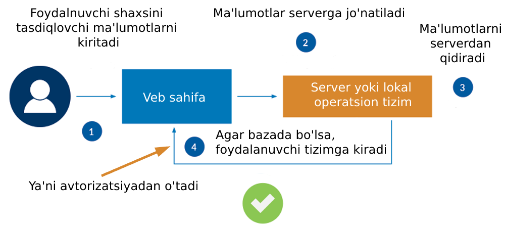
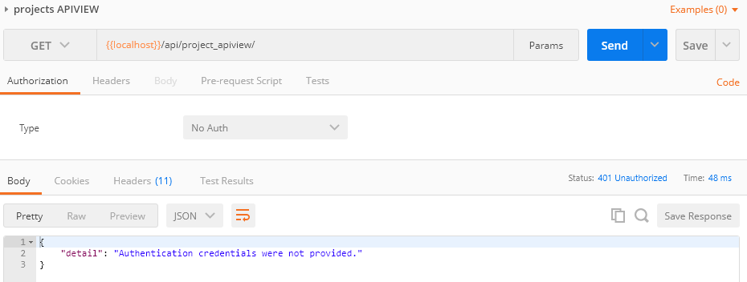
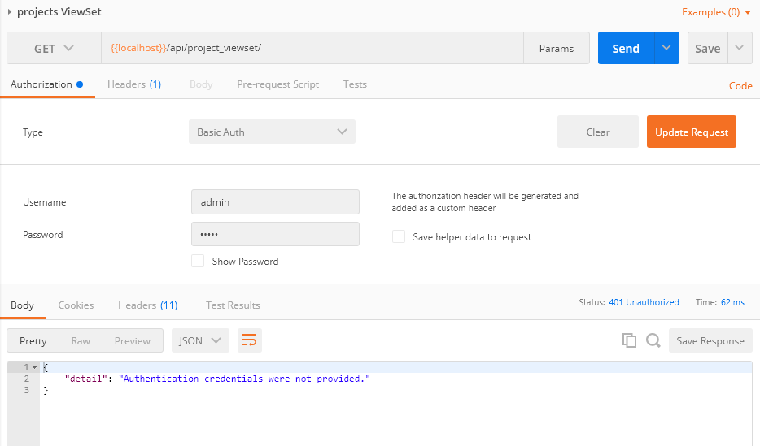
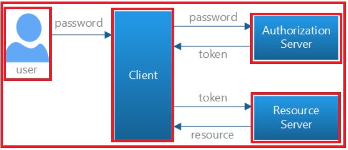

# Mavzu 11: Autentifikatsiya va avtorizatsiya

## Reja:

1. [Bilim](#1-bilim)
   - [1.1 Terminlar](#11-terminlar)
   - [1.2 O'qish uchun materiallar](#12-oqish-uchun-materiallar)
2. [Amaliyot. O'qituvchi](#2-amaliyot-oqituvchi)
3. [Amaliyot. O'quvchi](#3-amaliyot-oquvchi)

## 1. Bilim

### 1.1 Terminlar

```

```

## 2. Amaliyot. O'qituvchi

**Reja:**

- [2.1 Tushunchalar]
  - [2.1.1 Identifikatsiya]
  - [2.1.2 Autentifikatsiya]
  - [2.1.3 Avtorizatsiya]
- [2.2 Oddiy autentifikatsiya]
- [2.3 Tokenli autentifikatsiya]

- [2.4 Login, logout, register]

## 3. Amaliyot. O'quvchi

### 2.1 Tushunchalar

[Video](https://www.youtube.com/watch?v=_eLq8jO1T9o&list=PLZ67NWgKA8g7b-o4w5bm3B4fngZ2ug959&index=50)

#### 2.1.1 Identifikatsiya

<b>Identifikatsiya</b> - shaxsingizni tasdiqlovchi ma'lumotlarni taqdim qilish jarayoni. Masalan ism, familiya, login, parol, ERI, barmoq izi, ko'z, yuz shakli, ID karta va hak


#### 2.1.2 Autentifikatsiya

<b>Autentifikatsiya</b> - shaxsingizni tasdiqlovchi ma'lumotlarni haqiqiylikka tekshirish jarayoni



#### 2.1.3 Avtorizatsiya

<b>Avtorizatsiya</b> - foydalanuvchi roliga qarab tegishli sahifalardan tegishli amallar bilan foydalnishga ruhsat berish jarayonidir
<br>Tegishli sahifalarga mahsulotlar sahifasi, admin panel, login sahifasi, buyurtma berish sahifalari kiradi
<br>
<br>
Tegishli amallarga kiritish, o'qish, o'chirish, o'zgartirish amallari kiradi


Oddiy qilib tushuntirganda siz biron tashkilotga kirmoqchisiz. Jarayon tahminan mana bunday bo'ladi:


### 2.2 Oddiy autentifikatsiya

<p><b>Qadam - 1.</b></p>
Authentifikiatsiyani API hamma turlarida qanday ishlatilishini tushunib olish uchun avval bitta vazifani bajaradigan 5 xil ko'rinishdagi API yasaymiz, hammasi loyihalar ro'yxatini qaytaradi.

<p><b>projects/views.py</b></p>

```python
# api_view
from .serializers import *
from rest_framework import viewsets, mixins, generics
from rest_framework.decorators import api_view, permission_classes
from rest_framework.response import Response
from rest_framework.views import APIView

# ...

@api_view(['GET'])
def get_projects(request):
    print(request.user)
    projects = Project.objects.all().order_by('-vote_count')
    serializer = ProjectSerializer(projects, many=True)
    return Response(serializer.data)


# APIVIEW
class ProjectAPIView(APIView):

    def get(self, request):
        projects = Project.objects.all()
        serializer = ProjectSerializer(projects, many=True)
        return Response(serializer.data)


# Mixin
class ProjectMixin(mixins.ListModelMixin, generics.GenericAPIView):
    queryset = Project.objects.all()
    serializer_class = ProjectSerializer

    def get(self, request):
        return self.list(request)


# Generic view
class ProjectGeneric(generics.ListCreateAPIView):
    queryset = Project.objects.all()
    serializer_class = ProjectSerializer


# ViewSet
class ProjectViewSet(viewsets.ModelViewSet):
    queryset = Project.objects.all()
    serializer_class = ProjectSerializer

```

Marshrutini ko'rsatamiz

<p><b>projects/urls.py</b></p>

```python
from django.urls import path, include
from .views import *
from rest_framework.routers import DefaultRouter

router = DefaultRouter()
router.register('project_viewset/', ProjectViewSet)

urlpatterns = [
    path('', include(router.urls)),
    path('project_function/', get_projects),
    path('project_apiview/', ProjectAPIView.as_view()),
    path('project_mixin/', ProjectMixin.as_view()),
    path('project_generic/', ProjectGeneric.as_view()),
]
```

Hammasini Postmandan ishga tushiramiz


Endi bu APIni faqat ro'yxatdan o'tganlar (autentifikatsiyadan o'tgan) uchun chegaralaymiz
<br>Autentifikatsiyani bir necha hillari bor. Eng oddiysi parol va loginga asoslanadi. Hozir shuni ko'rib o'tamiz.

<p><b>Qadam - 2.</b></p>
Autentifikatsiya turini global o'rnatish uchun setting.py fayliga quyidagi kodlarni yozamiz:

```python
REST_FRAMEWORK = {
    'DEFAULT_AUTHENTICATION_CLASSES': [
        'rest_framework.authentication.BasicAuthentication',
        'rest_framework.authentication.SessionAuthentication',
    ]
}
```

Endi API lar uchun sozlashlarni amalga oshiramiz

```python
# api_view
from rest_framework.decorators import api_view, permission_classes
from rest_framework.permissions import IsAuthenticated
from rest_framework.response import Response

@api_view(['GET'])
@permission_classes([IsAuthenticated])
def get_projects(request):
    print(request.user)
    projects = Project.objects.all().order_by('-vote_count')
    serializer = ProjectSerializer(projects, many=True)
    return Response(serializer.data)
```

Izoh:

- @permission_classes([IsAuthenticated]) - agar autentifikatsiyadan o'tgan bo'lsagina bu APIdan faydalanishga ruxsat bor degani

Endi Postmanda sinab ko'ramiz

Autentifikatsiya kerakli ma'lumotlar taqdim qilinmagan degan habar chiqdi. Endi bu APIdan foydalanish uchun parol va login bilan foydalanishimiz kerak bo'ladi


Qolgan 4 ta APIlarda ham parol login bilan foydalanishni talab qilmoqchi bo'lsak class ga permission_classes = [IsAuthenticated] kodini yozamiz:

```python
from .serializers import *
from rest_framework import viewsets, mixins, generics
from rest_framework.permissions import IsAuthenticated
from rest_framework.decorators import api_view, permission_classes
from rest_framework.response import Response
from rest_framework.views import APIView

# ...

# APIVIEW
class ProjectAPIView(APIView):
    permission_classes = [IsAuthenticated]

    def get(self, request):
        projects = Project.objects.all()
        serializer = ProjectSerializer(projects, many=True)
        return Response(serializer.data)


# Mixin
class ProjectMixin(mixins.ListModelMixin, generics.GenericAPIView):
    queryset = Project.objects.all()
    serializer_class = ProjectSerializer
    permission_classes = [IsAuthenticated]

    def get(self, request):
        return self.list(request)


# Generic view
class ProjectGeneric(generics.ListCreateAPIView):
    queryset = Project.objects.all()
    serializer_class = ProjectSerializer
    permission_classes = [IsAuthenticated]


# ViewSet
class ProjectViewSet(viewsets.ModelViewSet):
    queryset = Project.objects.all()
    serializer_class = ProjectSerializer
    permission_classes = [IsAuthenticated]
```



Parol loginlarni taqdim qilamiz:


### 2.3 Tokenli autentifikatsiya

Hozir Simple JWT nomli kutubhonani ko'rib o'tamiz.
<br>
JWT - JSON Web Token. DRF uchun mo'ljallangan authentifikatsiya kutubhonasi
<br>
[JWT haqida hujjat](https://django-rest-framework-simplejwt.readthedocs.io/en/latest/)
<br>
Endi Autentifikatsiyani ikkinchi turii bo'lgan Token bilan tanishamiz. Bu yerda login va parol o'rnida token ishlatiladi. Bu oldingisiga nisbatan havfsiz hisoblanadi, chunkki token o'zgaritirb turish mumkin, va parol login ochiq bo'lmaydi.
<br>

<p><b>Qadam-1</b></p>

Buning uchun avval quyidagi buyruq bilan kutubhonani o'rnatib olamiz:

```text
>>> pip install djangorestframework-simplejwt
```

<p><b>Qadam-2</b></p>

Ruxsat berish (permission) va autentifikatsiya (authentification) turlarini ko'rsatish. Oddiy autentifikatsiyani global qilib o'rnatgandik, keling bunisini tegishli klassga beramiz. Masalan ViewSet klasiga beramiz:

<p><b>projects/views/py</b></p>

```python
# ...
from rest_framework_simplejwt.authentication import JWTAuthentication

# ...

# ViewSet
class ProjectViewSet(viewsets.ModelViewSet):
    queryset = Project.objects.all()
    serializer_class = ProjectSerializer
    permission_classes = [IsAuthenticated]
    authentication_classes = [JWTAuthentication]


```

Endi Postmandan parol login bersak ham ishlamaydi



Sababi endi autentifikatsiya sifatida token bilan berish kerak



Tokenni olish uchun bir marta parol login taqdim qilinadi, keyin esa autentifikatsiya uchun faqat token ishlatiladi. Token orqali server foydalanuvchini tanib oladi. Endi token olish jarayonini ko'ramiz

#### login

<p><b>urls.py</b></p>

```python
# ...
from rest_framework_simplejwt.views import (
    TokenObtainPairView,
    TokenRefreshView,
)

# ...

urlpatterns = [
    # ...
    path('api/token/', TokenObtainPairView.as_view(), name='token_obtain_pair'),
    path('api/token/refresh/', TokenRefreshView.as_view(), name='token_refresh'),
    # ...
]
```

JWT sahifasida settings menyusiga kirib sozlamalarni ko'chirib olamiz, so'ng ba'zilarini o'zimiga moslashtirib olamiz:

<p><b>settings.py</b></p>

```python

# ...

INSTALLED_APPS = [
    # ...
    'rest_framework_simplejwt',
    # ...
]
#
from datetime import timedelta
# ...

SIMPLE_JWT = {
    'ACCESS_TOKEN_LIFETIME': timedelta(days=5),
    'REFRESH_TOKEN_LIFETIME': timedelta(days=30),
    'ROTATE_REFRESH_TOKENS': False,
    'BLACKLIST_AFTER_ROTATION': False,
    'UPDATE_LAST_LOGIN': False,

    'ALGORITHM': 'HS256',
    'SIGNING_KEY': SECRET_KEY,
    'VERIFYING_KEY': None,
    'AUDIENCE': None,
    'ISSUER': None,
    'JWK_URL': None,
    'LEEWAY': 0,

    'AUTH_HEADER_TYPES': ('Bearer',),
    'AUTH_HEADER_NAME': 'HTTP_AUTHORIZATION',
    'USER_ID_FIELD': 'id',
    'USER_ID_CLAIM': 'user_id',
    'USER_AUTHENTICATION_RULE': 'rest_framework_simplejwt.authentication.default_user_authentication_rule',

    'AUTH_TOKEN_CLASSES': ('rest_framework_simplejwt.tokens.AccessToken',),
    'TOKEN_TYPE_CLAIM': 'token_type',
    'TOKEN_USER_CLASS': 'rest_framework_simplejwt.models.TokenUser',

    'JTI_CLAIM': 'jti',

    'SLIDING_TOKEN_REFRESH_EXP_CLAIM': 'refresh_exp',
    'SLIDING_TOKEN_LIFETIME': timedelta(minutes=5),
    'SLIDING_TOKEN_REFRESH_LIFETIME': timedelta(days=1),
}
```

Izoh:

- ACCESS_TOKEN_LIFETIME - token ishlash muddati
- REFRESH_TOKEN_LIFETIME - token islash muddati tugaganda yangilash uchun token muddati

Ishga tushiramiz, so'ng Postmanda tekshiramiz.


Endi /api/project_viewset/ APIga qaytamiz, bu API da biz parol login emas, hozirgina qo'lga kiritan tokenni kiritamiz:


Eslatma Tokendan oldin Bearer so'zini qo'shib ketamiz.

### 2.4 Login, logout, register

Qadam - 1

<p><b>settings.py</b></p>

```python
# ...


INSTALLED_APPS = [
    # ...
    'rest_framework',
    'rest_framework.authtoken',
    'django_filters',
    # ...
]
# ...

REST_FRAMEWORK = {

    'DEFAULT_PERMISSION_CLASSES': [
        'rest_framework.permissions.AllowAny',
    ],
    'DEFAULT_AUTHENTICATION_CLASSES': [
        'rest_framework.authentication.TokenAuthentication',  # <-- And here
    ],
}
```

```text
>>> python manage.py makemigrations
```

Qadam - 2

<p><b>users/urls.py</b></p>

```python

urlpatterns = [
    # ...
    path('login/', login_user),
    path('logout/', logout_user),
    path('register/', register_user)
]

```

Qadam - 3

<p><b>users/views.py</b></p>

```python
from django.contrib.auth import authenticate, login, logout
from rest_framework import viewsets, status
from rest_framework.authtoken.models import Token
from rest_framework.decorators import api_view
from rest_framework.response import Response


# ...

@api_view(["GET"])
def logout_user(request):
    request.user.auth_token.delete()
    logout(request)
    return Response('User Logged out successfully')


@api_view(['POST'])
def login_user(request):
    data = request.data
    print(data)
    login = data['username']
    password = data['password']

    if not login:
        return Response({
            'status': status.HTTP_400_BAD_REQUEST,
            'message': 'Login talab etiladi'
        })
    if not password:
        return Response({
            'status': status.HTTP_400_BAD_REQUEST,
            'message': 'Parol talab etiladi'
        })

    user = authenticate(username=login, password=password)
    print(user)
    if not user:
        return Response({
            'status': status.HTTP_400_BAD_REQUEST,
            'message': 'bunday foydalanuvchi bazada yo''q'
        })

    token = Token.objects.get_or_create(user=user)[0].key
    return Response(
        {
            "token": token
        }
    )


@api_view(['POST'])
def register_user(request):
    data = request.data

    login = data['username']
    password = data['password']

    if not login:
        return Response({
            'status': status.HTTP_400_BAD_REQUEST,
            'message': 'Login talab etiladi'
        })
    if not password:
        return Response({
            'status': status.HTTP_400_BAD_REQUEST,
            'message': 'Parol talab etiladi'
        })

    user = authenticate(username=login, password=password)

    if user:
        return Response({
            'status': 400,
            'message': 'Bu foydalanuvchi bor'
        })


    try:
        user = User.objects.create(
            username=login,
            password=password
        )
    except Exception as e:
        return Response({
            'status': 400,
            'message': 'Foydalanuvchi yaratishda xatolik yuz berdi'
        })
    token = Token.objects.get_or_create(user=user)[0].key
    return Response({
        'message': 'Foydalanuvchi qo''shildi',
        "token": token,
        "is_admin": user.is_staff
    }, status=status.HTTP_201_CREATED)


```
